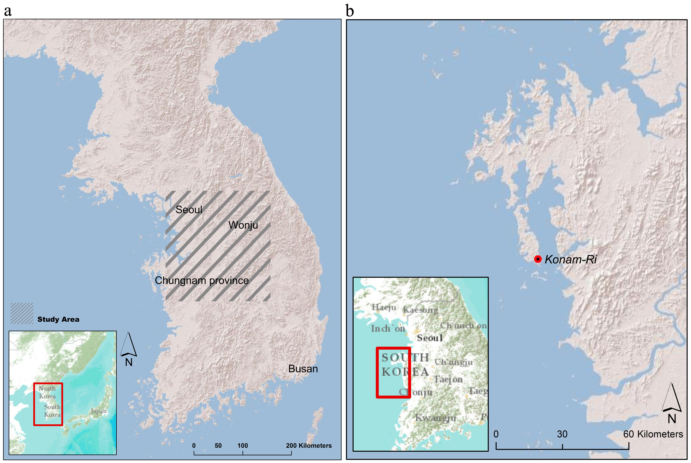
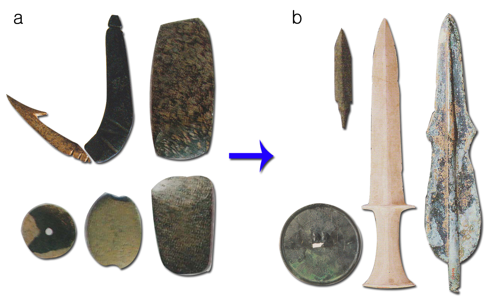
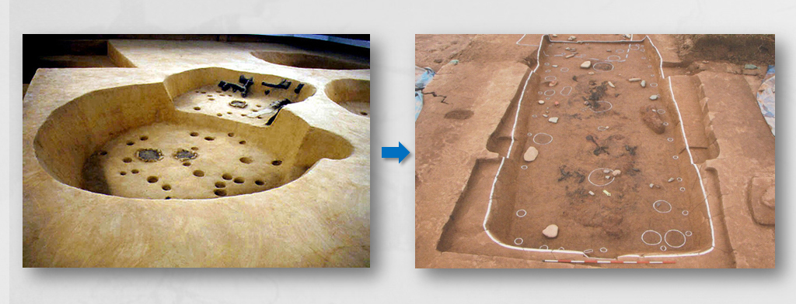
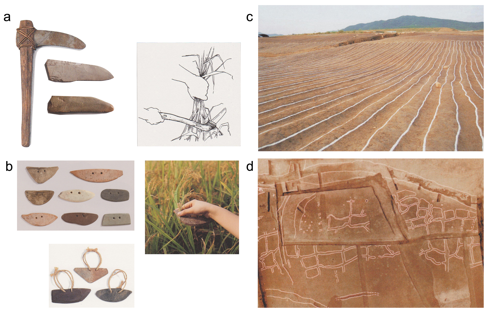

```{r, echo=FALSE, cache=FALSE}
set_parent("thesis.Rmd")
```

\chapter{Background and Central Hypothesis}

\section{Introduction}

In this chapter, first I will discuss the history and social context of Korean archaeology focusing on Japanese annexation of the country. Then, I will elucidate the current views on the transition from foragers to farmers and development of rice agriculture in the Korean Peninsula in detail. The problems with these existing studies will be stated based on the recent scientific evidence. Lastly, I will clarify main hypothesis of this thesis.    

\section{Archaeology in Korea - Its brief history and social context}

The whole Korean peninsula is populated with Koreans. Though there are some regional dialects, in regard of its culture and language Korea includes no recognized minorities. Therefore, traditionally, the Korean prehistory is frequently formulated in Korea with reference to ethnicity, perceiving the elucidation of the formation of the Korean people to be the chief purpose of archaeology. In the twentieth century, the Korean peninsula underwent a series of dramatic political upheavals. This political fluctuation began with the Japanese annexation of the country in 1910. The liberation of the Korean peninsula in 1945 after the end of the World War II was followed by the Korean War (1950–1953) and the subsequent establishment of two competing states: the Republic of Korea (South Korea) and the Democratic People’s Republic of Korea (North Korea). This political context established a particular and unique social milieu, which critically influenced archaeological practices. The modern practices of archaeology in Korea were first conducted by Japanese archaeologists such as Tadashi Sekino, Ryuzo Torii, and Ryu Imanishi during the colonial period. Archaeological remains, which are inherently subject to a variety of interpretations, were easily exploited to justify the Japanese colonization of Korea (Kim, 2008). Through this, Japanese archaeologists tried to claim that the Korean people were characterized by “a lack of independence” and “a servile attitude towards bigger nations.” Though it seems that this is a typical example of “Colonialist archaeology” of Trigger (1996; 2008), there is a huge difference between the one and the other. The colonizers were Japanese, not Europeans. Though one might argue this is unimportant, in fact, it is. While European colonizers did not have any cultural or historical similarities with Native Americans, Japan and Korea have actively been interacting to each other since the Late Neolithic Age. For this reason, the archaeological phenomena of Korea and Japan are quite similar. Therefore, Japanese archaeologists who practiced archaeology in Korea argued that all prehistoric/historic material cultures were handed down from the Japanese isles to the Korean peninsula. The primary character of the “Colonialist archaeology” defined by Trigger is denigrating native peoples by presenting the primitive aspects of their archaeological phenomena. However, in this case, the Japanese justified their colonization by emphasizing the overall similarities and excellences of the prehistoric/historic material cultures of Korea and Japan.

As in many postcolonial nations, the Korean archaeology after the liberation from the Japanese colonization has taken a central role in refashioning national identity and restoring national pride (Kim, 2008). Especially in South Korea, archaeological phenomena have been being interpreted as evidences of migration and cultural diffusion throughout the Eurasian continent. Highlighting harmonious blending of different cultural traits and emphasizing cultural interactions over a vast region may appear to contradict nationalism which assumes the ethnic superiority. However, it should be noted that such interpretations describe the ancient Koreans as a people with a grandiose geographical scope whose life was not confined to a small peninsula. The interpretations of the archaeological phenomena in Korea often intentionally aim at suggesting creativity and superiority of the Korean people. Based on this, some archaeologists have recognized nationalism in the Korean archaeology and have described the current Korean archaeology as “nationalist archaeology” (Kim, 2008; Trigger, 2008).

However, in the middle of the 1990’s, archaeology in Korea started to make various voices. The 2nd generation Korean archaeologists who were educated in the United Kingdom and the United States as ‘graduate students’ began to conduct their own researches in Korea. Though they were highly influenced by the nationalism of the Korean archaeology from the first generation archaeologists, they also learned major theoretical frameworks and empirical methodologies from decent universities in US and UK. Currently, on one hand, these scholars are trying to avoid an extreme nationalism, and on the other, they are also concerned about the imperialist aspect of their knowledge originated from UK and US.



\section{“Chulmun” foragers and “Mumun” farmers - where everything started}

This dissertation investigates the process of transition from foraging to farming and the role of agriculture as a subsistence strategy during this transition in the central part of the prehistoric Korean Peninsula (Figure 2.1a). The period in question has been called the Mumun pottery period (c.f. Bale 2011: 3390-2290 calibrated years (cal.) B.P.). The traditional periodization scheme of the prehistoric Korea is based on the decorative attributes consistently found on the potteries that existed over specific time periods: 9950-3390 B.P. is the Chulmun (or ‘comb-pattern’) Pottery Period and 3390-2290 cal. B.P. is the Mumun (or ‘undecorated’) Pottery Period (Norton 2007; Bale 2011). Sometimes the former and the latter are respectively regarded as the Neolithic and Bronze Age of Korea (Ahn 2004; Norton 2007). The beginning of the Mumun Period has an important role in the Korean archaeology, for it has been linked with the beginning of the agricultural society. The Mumun Period, named after its representative patternless feature of pottery, is known for intensive rice farming, instead of hunting and gathering of the Chulmun Period. Also, with this economical evolution, the society became more complex and social hierarchy emerged. ‘Mumun’, term meaning ‘undecorated’, is the most common feature of the pottery in this period. Ahn Jae-ho devised this influential ‘Chulmun-Mumun’ periodization based on diagnostic changes in pottery decoration, pit-house architecture, interior pit-house features, and stone tool types (J. Ahn 1991, 2000, 2001). Ahn’s chronology assumes that changes in pottery decorative attributes and plan-shapes of pit-houses are time-sensitive. According to him, the Mumun periodization scheme has the following internal stages: Incipient, Early, Middle, and Late.

Korean archaeologists have been focusing on the differences between the overall archaeological assemblages of the Chulmun and Mumun periods. Now, I will briefly examine the different aspects of the archaeological assemblages from the two periods.

To begin with, in the case of pottery, the fundamental characteristics of the Chulmun Period pottery are the comb-shape pattern and the pointed bottom, which show some variations as the phases go by (Figure \ref{CMpottery}a). Some pieces of the Chulmun Period pottery from the Gangwon province (Figure \ref{site_locations}) have the flat bottom, but this shape is considered as an exception to the general form of the Chulmun Period pottery. On the other hand, all the Mumun Period pottery have the flat bottom; the major part of their body does not have any pattern. Some patterns still existed, but confined to the extreme upper body. During the incipient stage of Mumun, potteries had a pinched clay strip attached to the outside of the rim and body (S. Cheon 2005; \ref{site_locations}; \ref{Mpatterns}a). Early Mumun potteries have both rim-punctuations and lip-scoring. This combination of attributes is sometimes referred to as Yeoksam-dong-style pottery (B. Lee 1974; Figure \ref{site_locations}; \ref{Mpatterns}c) after the site where they first uncovered. Another pottery style of the Early Mumun, Garak-dong (B. Lee 1974; Figure \ref{site_locations}; \ref{Mpatterns}b), is named after a site in Seoul, but settlements with this pottery tradition are found clustered in the tributary valleys of the Geum-gang River. Garak-dong style deep-bowls have appliqué rims (or double rim) with short slanted lines that are incised just below where the rim attaches to the body. The last type of the Early Mumun potteries is the Heunam-ri-style pottery, which is a combination of Yeoksam-dong and Garak-dong styles (J. Ahn 2000:49; J. Kim 2001; S. Lee 2005; Figure \ref{site_locations}; Figure \ref{Mpatterns}d. From the Middle Mumun Period, potteries become completely undecorated. The most dominant one is Songguk-Ri-style pottery (Figure 1.1; Figure \ref{Mpatterns}e) which has elongated and curved shapes with everted rims in comparison with Early Middle Mumun pottery (Norton 2007).  


The manufacturing technique of stone tools shows too discrepancies between the two periods. Though polished stone tools started to be used in the Chulmun Period, their qualities and the skill of their production are relatively poorer than those of the Mumun Period (Figure \ref{CMtool}a). The stone tools of the Mumun Period including the polished stone arrowhead and dagger, which were excavated in the central part of the Korean peninsula, are very elaborate and exquisite (Figure \ref{CMtool}b). Also, from the middle of the Mumun Period, we begin to observe bronze ware.  




The form of habitations also changes. The Chulmun Period's houses have generally a round shape, but this shape was transferred into a rectangular style longhouse in the Mumun Period (Figure \ref{CMhouse}). Inside the longhouse, we can observe a row of 3 or 4 hearths for warming/cooking, which are not seen in that of the Chulmun Period. In a few words, the Chulmun Period's pottery with the pointed bottom and comb-shape pattern, and its polished stone tools and round-shape habitation were changed into the patternless flat-bottom pottery, elaborate polished stone tools and rectangular-shape habitation.

Together with these differences in characteristics of the archaeological assemblages of the two periods, Korean archaeologists assume that the most distinctive difference between the two periods consists in their subsistence strategies. Agriculture brought a great change into human life. Engaging in farming, human beings settled down for the first time. In the Korean Peninsula, it is argued that in the Mumun period agriculture became the main means of living due to rice. Clear evidence including stone sickles (Figure \ref{farming}a), “semi-lunar shaped” stone knife (Figure \ref{farming}b), as well as dry field (Figure \ref{farming}c) and irrigated rice paddies (Figure \ref{farming}d) shows that full-dress farming was practiced in this region around the beginning of the Mumun Period (G. Lee 2003; 2011; T. Yoon and J. Bae 2010). Korean archaeologists think that agriculture was introduced in the Chulmun Period's late phase and the rice agriculture spread widely in the Mumun Period's early phase to be the principal subsisting way in the Mumun Period's middle phase. They think that though agriculture was introduced during the Chulmun period, the main subsistence in this period was confined to hunting, fishing, and gathering. Normally, the start of the rice agriculture is treated as being very important; and the site that gave initially grains of rice, burned or not, is thought to have a critical meaning. However, what matters is not the start of the rice agriculture, but its general practice. Korea is an agrarian country even nowadays, and rice is still the staple food of the Korean people. Therefore, it is essential to know when the ancients of the Korean peninsula started to eat rice as staple food.



\section{Current views on the transition from foragers to farmers and development of rice agriculture in the Korean Peninsula}

The transition from foragers to farmers in the Korean peninsula has been approached by assuming a strict dichotomy between Chulmun hunter-gatherers and Mumun full-dress rice farmers (J. Ahn 2000; B. Kim 2006a). The transition was linked with multiple migration events coinciding with climate change (J. Kim 2003; 2006), or assumed to be driven by population growth (Norton 2000, 2007), or regarded as consequence of a risk reduction strategy (J. Lee 2001). 

Until recently, quantitative analyses of marine resources from coastal shell middens have been the primary data source for investigating patterns of subsistence in Korea (J. Lee 2001, 2006; Norton 2000, 2007; cf. G. lee 2011). For example, J. Lee (2001) argued that people used farming as a risk-reduction strategy against the declining sea level on the east and south coasts, as the ratio between the population and marine resources became imbalanced after 4,000 BP. By comparing the results of the analyses of marine resources from the shell middens of the west, east, and south coasts, J. Lee argued that farming emerged to overcome the loss of marine resources along the east and south coasts. 

Similarly, Norton (2000) emphasized population growth as one of the key factors for the adoption of rice farming along coastal settings. He examined the remains of marine resources from the Konam-Ri shell midden (Figure \ref{study-area_Konam-ri}b), located on the west coast of the Korean peninsula. Based on the result of this examination, he suggested that the differential processing of large fish might be an evidence of residential stability. Residential stability, he argued, led to the increased population throughout the hunter-gathering stage. This increase, and the associated increased human predation, caused a decrease in the size of fish and other favored taxa, and subsequently pushed the hunter-gatherers to adopt rice farming (Norton 2000). 

J. Kim (2003, 2006) suggests a combination of environmental fluctuation and subsequent human migrations from northern latitudes as a major factor of the agricultural transition in the central part of the Korean peninsula. Based on paleoclimate data for the early Holocene East Asia, he argued that because of cooling climate and decreasing temperature around 4,000–3,000 BP, the farmers in the Jilin-Duman regions along the current border with China might have migrated to the central part of the Korean peninsula, which was better suited for farming. He presented a sudden change in household pattern and the presence of finely ground stone daggers around the central part of the Korean peninsula as evidences of these migrations. In addition, Kim assumes that the mobility of indigenous hunter-gatherers was constrained when immigrant rice farmers blocked their way to resource patches. The inaccessibility of foraging areas enhanced the transition of hunter-gatherers to farmers (J. Kim 2006). 

Lastly, B. Kim (2005; 2006a; 2006b) focused on the emergence of a complex society associated with an intensive rice agriculture around 2,600BP. By correlating regional scale survey data from the south-eastern Chungnam province (Figure 1.1) with its soil productivity for rice agriculture based on a site catchment analysis of the region, Kim argued that the emergence of a social hierarchy and the subsequent social complexity were driven by the rapid spread of the intensive rice agriculture into foraging contexts. He asserted that this rapid transition is examplified by the sudden presence of harvesting tools of ground stone.  

There are two underlying key ideas that these studies have in common, but both are problematic. The first two studies assume that shell middens can represent the general process of subsistence change from foragers to farmers in the central part of the Korean peninsula. Since a peninsula,  consequently the Korean Peninsula is a part of a continent, the data from the coastal shell middens cannot represent the subsistence of the inland, which includes considerably large habitation sites. Next, all the four studies assume rice to be a dominant subsistence resource since 3,400 BP, without considering the possibility of the utilization of a more wider range of resources for subsistence. 

According to archaeobotanical evidences from the southern part of the Korean peninsula, which includes the Daundong site in Ulsan and several localities within the context of the Nam River in Jinju (Oun I, Okbang 1,2,4,6 and 9, Sangchon B), the diet of the ancient farmers of the region included various resources such as millet, soybean, and azuki between 3400 and 2,600 B.P. (Crawford and Lee 2003; G. Lee 2003, 2011) (Figure 1.1). I assume the subsistence pattern might be similar in the central part of the Korean peninsula during this period, though we lack, for the moment, clear paleobotanical evidences to test this assumption. Therefore, the re-evaluation of those rice-centered models is required, and the general chronology of subsistence during this period has to be established. 



\section{The central hypothesis of this thesis}

Studies have shown that in some cases, the initial domestication of crops and subsequent agriculture appeared as a part of the complex foraging economies in an affluent environment (Price and Bar-Yosef 2011; Price and Gebauer 1995) and hunting, gathering and fishing persisted well after farming was introduced (Boric 2002; Craig et al. 2011; Galili et al. 2002; Milner et al. 2004). In the Yangtze River Valley in China, for example, as well as in the Sub-Saharan Africa and the eastern North America, evidences of very early domestication come from settlements situated in zones with very rich resources which are associated with river valleys, and in none of these areas does domestication appear to have developed within a context of population growth forcing humans into marginal environmental zones (Smith 2007). New strategies such as agriculture were initiated by relatively complex hunter-gatherers in circumstances where risk is affordable. Then why did these foragers invest their efforts in agriculture when there was no immediate risk? The key idea for the reply to this question is that an increased sedentism was a “pre-requisite” for the advent of agricultural societies, for complex hunter-gatherers are characterized by a relatively large population and sedentism (Price and Gebauer 1995: 8). Recent case studies in the eastern North America by Smith (1995; 2007; 2011) are good examples. Smith argued that many of our present domesticated plants originated from the weeds growing in the open habitats created by rivers (e.g. floodplain), and they were easily adapted to open areas in the habitats disturbed by human sedentary settlements. Those weeds that invaded open areas in human settlements eventually became domesticated in conformity with the natural outcome of the selective relationship between people and plants within a stress-free environment (Smith 2007; 2011). Even the Jomon Japan, the period that is traditionally considered as giving an “affluent” hunter-gathering context based on sedentism, showed clear evidences of plant domestication (Obata et al. 2007). Recently, Crawford (2011) stressed that the orthodox view that the Jomon sustained hunting and gathering for millennia in a naturally rich environment is oversimplification if not correct. 

This situation could have existed in the prehistoric Korea. We have solid evidences of a long-term, permanent occupation of the peninsula by complex hunter-gatherers at various places since around 6,000 BP. At the Amsa-Dong Site (Figure 1.1) in the south-east Seoul, at least 12 houses, a significant amount of pottery and different types of ground stone tools such as arrow points, spear points and sickles, were excavated (H. Lim 1985). Considering that the site was not fully excavated, and based on the scale of the houses as well as the diversity of ground stone artifacts, we can easily assume that this provides clear evidences for sedentism. The house structures and seasonality of the faunal assemblages at the Tongsam-Dong site (Figure 1.1) in the southern part of the Korean Peninsula indicate that people lived there year-round on a permanent basis (J. Lee 2001). We have pollen data from 5,500 BP to 2,600 BP showing that there were specific subsistence solutions which include distinctive combinations of wild (e.g. acorn (QuercusacutissimaCarr.), Manchurian walnut (Juglans spp.)), possibly managed (e.g. chenopod (Chenopodium sp.), panicoid grass (Paniceae)), and domesticated (e.g. foxtail (Setariaitalica ssp. italica) and broomcorn millet (Panicummiliaceum), possibly soybean (Glycine max), azuki (Vignaaugularis) and beefsteak plant (Perillafrutescens (L.) Britt)) plants (G. Lee 2011: S326). On the other hand, though we lack the evidence of faunal remains due to the high acidity of sediment in the Korean peninsula, it is still possible that hunting and fishing may have persisted along with farming after its introduction (cf. Craig et al. 2011; Milner et al. 2004).  

In this regard, the prevailing rice-centered models, which assume rice to be the most dominant subsistence resource since 3,400 BP., are misleading. My hypothesis is that there was utilization of a wider range of animals and plants resources along with rice among ancient farmers in the central part of the Korean peninsula between 3,400 and 2,000 BP. What is overlooked in the subsistence studies of the prehistoric Korea is the distinction between the first adoption of crops and the later development of intensive agriculture (G. Lee 2011). The migrants (cf. J. Kim 2006), if there were any, probably needed time to adjust themselves to the local environmental conditions, particularly for rice agriculture, which required complicated irrigation techniques. As G. Lee (2011) noted, rice may have played a minor subsistence role at this time, and it may not have served as a driving factor of the emergence of social complexity.

\section{Summary}

In this chapter, first I have discuss the history and social context of Korean archaeology focusing on series of political upheavals related to Japanese annexation. Next, I elucidated the current studies on the transition from foragers to farmers and development of rice agriculture in the Korean Peninsula. Then, the problems with these existing ideas stated based on the recent scientific evidence from the Korean peninsula and Japan. Lastly, I clarified main hypothesis of this thesis in detail.    
