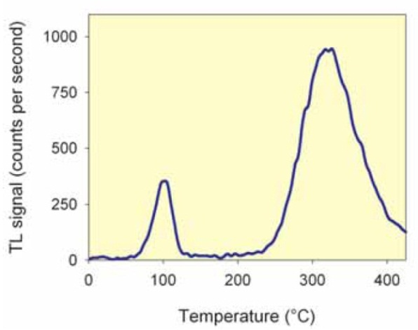
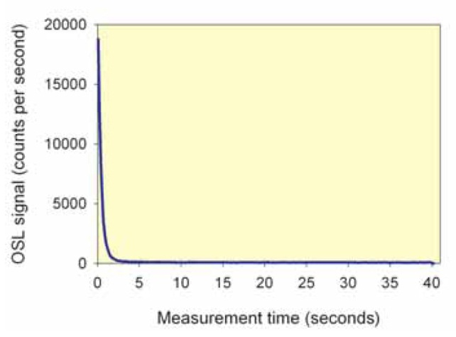

```{r, echo=FALSE, cache=FALSE}
set_parent("thesis.Rmd")
```

\chapter{Methodological background, Research design and analytical procedure of Luminescence dating}

\section{Introduction}

To evaluate my hypothesis and to establish a general chronology of subsistence from 3,400 to 2,000 BP, I used the organic geochemistry and luminescence dating methods on the pottery excavated from three major inland sites in the central part of the Korean peninsula. In Korean archaeology, pottery is one of the main objects for archaeological analysis, being abundant in the Korean Peninsula in almost every archaeological assemblage in the sites that post-date 6,000 BP. This abundance allowed archaeologists to develop a detailed Korean archaeological chronology based on the pottery shape, size and decoration. Though this intensive chronology-building has much contributed to Korean archaeology, almost no attention has been given to analyzing the fabric of pottery itself. This is a surprising omission and represents a serious gap in our understanding of prehistoric technology and subsistence. The above methods allow us to identify what was stored and cooked in the pots as well as to date them directly, so that we can understand how subsistence changed over time. Accordingly they let me directly test the hypothesis posited precedently: that there was utilization of a wider range of resources among ancient farmers in the central part of the Korean peninsula between 3,400 and 2,000 BP and rice seems to have played no more than a minor role in subsistence during this period. In this chapter, I will discuss about the methodological background, Research design and analytical procedure of Luminescence dating. I will elucidate some of the main principles of luminescence dating and its application history to the Korean archaeology. I will also describe the laboratory analysis process in detail. 

\section{Luminescence dating in archaeology}

In terms of pottery chronology, archaeologists have used stratigraphy that indicates a depositional event: when the artifacts were buried together, not specifically when they were manufactured. Dating these depositional events or "occupations" (Dunnell 1971: Raffeny 2008) is a usual goal but it is not quite same as dating manufacturing events. Archaeologists have not always distinguished occupational event and manufacturing event in practice (cf. Feathers 2009). In addition to stratigraphy, another method employed by archaeologists was seriation based on the physical characteristics of the potteries. However, this also has an inherent problem because transmission of the physical characteristics can occur across space (Dunnell 1970; Feathers 2009). To ascertain that seriations are mainly entangled to time, they must be restricted in space. Lack of control over spatial variation means it is difficult to tell whether there are sequential or special differences between each stage of seriation. The radiocarbon dating somewhat fitted with those traditional approaches, for this well-known absolute dating method mostly does not date the potteries themselves but nearby organic remains (e.g. Charcoal).  This means the dating event inevitably has a variable relation to the target event of pottery manufacture. 

Luminescence dating dates manufacturing event: when the pottery was made. To understand the chronology of subsistence, what archaeologists need to know is cooking event. Since cooking event is more likely associated with manufacturing event than depositional event, luminescence dating is probably the most suitable method for creating subsistence chronology. 

###3.3 Luminescence: the principals
Luminescence dating is an absolute dating method that has been used both intensively and extensively in the field of archaeology and earth sciences. It is based on the emission of light, luminescence, from minerals. In case of pottery, burnt flints, or burnt stones, the dated event is the last heating of the objects. Another common application is dating sediments. In this case, the event being dated is the last exposure of the mineral grains to light. The age range which the method can be applied is from a century or less to over one hundred thousand years.

Radioactivity is ubiquitous in the natural environment. Luminescence dating utilizes the radioactive isotopes of elements such as uranium (U), thorium (Th) and potassium (K) (Feathers 2003). Naturally occurring common minerals such as quartz and feldspars act as dosimeters, showing the amount of radiation to which they have been exposed (Duller 2008). A common characteristic of these naturally occurring minerals is that when they are exposed to the light emitted by radioactive decay, they tend to store some proportion of the energy delivered by the radiation within their crystal structure. The minerals accumulate this energy as exposure to radioactive decay continues through time. When this energy is released at some later date, these minerals release the energy in the form of light. This light is what we call luminescence. 

Luminescence is explained by the solid state energy band theory (Aitken 1985; 1998; McKeever and Chen 1997). The interaction between radiation and the crystal structure provides energy to electrons that can be raised from valence band to the conduction band. Because of this stage, electrons become trapped within the crystal. In ideal situation, electrons cannot be trapped within the crystal structure, but this is possible because of defects within the structure. The electrons may be stored (and accumulated) at these defects for certain period. By the time these electrons are released, they lose the energy delivered by the radiation, and may emit part of that energy in the form of a single photon of light (Duller 2008). 

The reason we can use this phenomenon for dating lies in the fact that this energy stored in minerals can be reset by two processes. The first process is by heating the material to the temperature above about 300°C: the process that occurs in a hearth or kiln during firing of pottery. The second is exposure to daylight, as may occur during erosion, transportation, or deposition of sediments. Either of these processes releases any existing energy, and thus set the ‘clock’ to zero (Duller 2008). Therefore, in luminescence dating, the event being dated is the last resetting of this clock, either by heat or light.

Measurements of the brightness of the luminescence signal can be used to calculate the total amount of radiation that the sample absorbed during the period of burial. If this can be divided by the amount of radiation that the sample receives from its surroundings per year, this will give the duration of time that the sample has been receiving energy: the age (Duller 2008).

$$\text{age} = \frac{\text{total amount of radiation exposed during burial (equivalent dose)}}{\text{amount of radiation recieved each year (dose rate)}}$$


There are a number of naturally occurring minerals that emit luminescence signals, including quartz, feldspars, and calcite. Among them, quartz and feldspar are the most suitable and ubiquitous material for dating (cf. Feathers 2003; 2009). The luminescence age is the period of time that has passed since the sample was heated or exposed to daylight. The age is given as the number of years before the date of measurement. Since there is no designate datum for luminescence ages, the date of measurement must be noted. The term BP (before present) should never be used for calculating luminescence age, for BP designates specific datum point and is only proper for radiocarbon ages. 

The energy that stored within minerals’ crystal structure can be released using a number of laboratory methods.

\subsection{Thermoluminescence}

Heating the sample at a certain rate from room temperature up to 700°C releases the trapped electrons within the crystal structure. The resulting signal from this process is called thermoluminescence (hereafter TL). Typically the TL signal comes with a series of peaks (Figure \ref{TL-signal}). Each peak may indicate a single type of trap within the mineral, and commonly the signal is comprised of several traps. Although it is not always possible to identify the source of electrons precisely, in most cases TL signal observed at highest temperature originates from trap that is deepest below the conduction band (more energy is required to release electrons from deeper traps, and therefore this occurs at higher temperature).



\subsection{Optically stimulated luminescence}

A second way of releasing the electrons stored within minerals is by exposing them to laboratory light (Huntley et al 1985). As soon as the mineral exposed to light, luminescence is emitted from the mineral grains. The signal is termed optically stimulated luminescence (hereafter OSL) and Figure 3.9 shows the signal from quartz during the stimulation. As measurement continues, the electrons in the traps are emptied away and the signal starts to decrease drastically (Figure \ref{OSL-signal}). 



A similar signal is observed from other minerals including feldspar. However, OSL signal from feldspars decreases more slowly than that from quartz (Duller 2008). Unlike TL, the OSL signal does not shows multiple traps. Thus, before measuring the luminescence signal, it is important to thermally pretreat the sample to make sure that the measured signal is from the deepest traps. This is achieved by heating the sample before measurement so that the shallow traps  (whose electrons are unstable over the burial period) are emptied, leaving only the electrons in deeper, stable traps – this heating is called a preheat (Duller 2008: 6; Feathers 2003).

The light used to stimulate the minerals is restricted to certain range of LED lights.
Blue light emitting diodes are most widely used type for generating OSL signal from both quartz and feldspar. Another method of stimulation is using LEDs that emit beyond the visible part of the light spectrum: infrared stimulated luminescence (hereafter IRSL). IRSL is only observed from feldspars, for quartz does not produce an IRSL signal when the sample in room temperature (Duller 2008). Using these different characteristics of quartz and feldspar against the infrared light, a method for assessing the purity of quartz separated from feldspar for luminescence measurements can be provided. 

\section{Luminescence dating and its application to the Korean archaeology}

The luminescence dating is a technique for dating once-heated materials, and is used by archaeologists primarily to date ancient ceramics and sediments (Feathers 2003). This technique can measure the time that has elapsed since the last exposure to heat and light of the materials constituting the object. As this exposure event generally occurred when pottery was made, the luminescence dating is ideal for dating archaeological ceramics (Feathers 2003). The optically stimulated luminescence dating (hereafter OSL), infrared stimulated luminescence dating (hereafter IRSL), and thermoluminescence dating (hereafter TL) methods employed for dating ceramics have been quite common in Europe and the United States for nearly two decades, but they are yet to be widely used in Korea. Given the abundance of ceramics in Korean archaeological records, it is surprising that the luminescence technique has not been more frequently employed. Though it has been mentioned considerably since its initial introduction (J. Choi et al. 2006; J. Choi et al. 2009), it has been used mainly in the field of geology (J. Bang et al. 2009). In archaeology, after its applicability was considered (D. Hong et al. 2001), it has only been employed to date sediments in Paleolithic archaeological sites (J. Kim et al. 2010).  Probably the absence of archaeological luminescence dating of ceramics in Korea may be attributed to the uncritical acceptance of the relative chronologies. I partially agree to the detailed relative chronologies based on the decoration and style of potteries and their serviceable nature (H. Lee 2008; J. Bae 2007), but their applicability is quite low in subsistence change settings, for they are only based on the physical characteristics of pottery. Of course, the primary purpose of the luminescence dating in this research is to investigate the role of intensive rice farming and to establish the chronology of subsistence strategies over time by correlating the dates it obtained with the results of organic geochemistry analyses. However, with a systematic application of the luminescence dating, I was also able to grasp a glimpse of a more reliable chronology which can be easily applied to other archaeological studies. In 2011, I dated one potsherd from the archaeological deposit in Hongseong city, central part of the Korean peninsula. Using the thermoluminescence method, I was able to confirm that the potsherd was from the proto-historic period (280±86AD; U2516 in Table \ref{lumi_eg_date}). 


\begin{table}[h]
\begin{tabular}{llllllll}
Lab. No & Depth (m) & Water Content (\%) & Dose rate* (Gy/ka) & TL (De)                 & OSL (De)    & IRSL (De)   & Age       \\
U2516   & 0.36      & 20.4               & 5.532±0.277        & 8.712±0.91 & 8.586±0.331 & 7.215±0.361 & 280±86 AD \\
        &           &                    &                    & 11.665±1.423            &              &
\end{tabular}
\end{table}
		  
Table 3.1. The result of the luminescence dating (*Dose rates are rounded to two decimal places, but calculation of the total dose rate was carried out prior to rounding)

```{r table_lumi_eg_date, results='asis', echo=FALSE}
# read in the CSV file from /data
example_tab <- read.csv("data/lumi_eg_date.csv")
# for details of table formatting, see http://cran.r-project.org/web/packages/xtable/vignettes/xtableGallery.pdf
print(xtable(example_tab, 
             size="footnotesize", 
             caption="The result of the luminescence dating (*Dose rates are rounded to two decimal places, but calculation of the total dose rate was carried out prior to rounding)", 
             label="lumi_eg_date"),
      include.rownames=FALSE,
      booktabs = TRUE,
      floating = FALSE, 
      tabular.environment='longtable'
      )
```

All the samples for my research was dated at the Luminescence dating lab, Department of Anthropology, University of Washington. The Luminescence dating method enables the evaluation of the time that has passed since the mineral grains were crystallized, that is, since the grains were last exposed to daylight or heated to a few hundred degrees Celsius. Generally, as at the lab of the University of Washington, the method uses an optically and thermally sensitive light or luminescence signal emitted by minerals such as quartz and feldspar. For dating, the amount of absorbed energy (luminescence signal) per mass of mineral (1 J/kg= 1 Gray) due to the natural radiation exposure since the last zeroing - known as the palaeodose - is determined by comparing the natural luminescence signal of the sample with that which is induced by the artificial irradiation (Preusser et al. 2008). The time having passed since the last daylight exposure/heating (the date of the sample) is obtained through dividing the palaeodose by the dose rate, the latter representing the amount of energy deposited per mass of mineral by the radiation exposure on the sample over a certain time (Preusser et al. 2008). The potsherds in this thesis was dated by using this formula, and both of the two general methods, TL, OSL, and IRSL will be applied. For a further clarification, the dates from the luminescence dating were correlated with those from AMS radiocarbon dating.

\section{Analytical procedure}

The luminescence dating method enables evaluation of the time that has passed since mineral grains crystallized, which means it can measure the amount of time since the grains’ being last exposed to daylight, or heated to a few hundred degrees Celsius. Its technique was developed in an archaeological context, in Europe in the 1960s and 1970s, as a method of dating heated materials, primarily ancient ceramics and potteries (Feathers, 2003). It has been applied to a wide range of Quaternary researches such as landscape evolution, palaeoclimate, archaeology, and has been being refined since its early days. It dates the past exposure to heat and light, and because the events of this exposure are the actual events archaeologists are interested in, it has a strong merit over other dating methods (Feathers, 2003). In other words, in the luminescence method, the dating event is often the target event that the archaeologists are looking for. In this thesis, the luminescence dating was applied to eight archaeological ceramic samples.

\subsection{Sample preparation - grain size}

For the luminescence dating, determining the grain size is quite important, for there are advantages/disadvantages as well as different methods it occasions. Generally, fine grains (1-8 μm) are more abundant than coarse ones; and they can be analyzed with samples of relatively small amount. They also require a relatively simple sample preparation process, and rely less on the external dose rate, which is often problematic in a complex ceramic environment. However, if samples include feldspar grains (which cannot be separated from other grains during the sample preparation procedure), one has to deal with the high fading rate of feldspar (Wintle, 1973).

One of the biggest advantages of using coarse grains (180-212 μm) is the single grain analysis, which can be done only with coarse grains. Quartz grains are generally used for the analysis of coarse grains, because of its well-known properties and low fading rate. Since it is possible to minimize feldspar inclusion during the sample preparation process of coarse grain, we do not have to consider the fading of feldspar as a major variable. Also, because of the larger grain size and etching process during the sample preparation, the contribution of alpha radiation (which has a short range: 50μm) is minimal. This is a huge merit, for alpha radiation is much less effective in producing luminescence than beta and gamma radiations. In case of analyzing fine grains, this ‘low alpha efficiency’ must be considered. However, using coarse grains for the analysis requires a complicated sample preparation process and a larger amount of sample. Also, it cannot be totally exempted from the high fading rate, because feldspar has to be used for the single grain analysis in some cases (feldspar typically has a bright luminescence signal, which enables dating older deposits than with quartz; Preusser et al. 2008) where quartz shows an extremely low luminescence signal. It has also been verified that the quartz of volcanic origin may show anomalous fading, just like feldspar (Bonde et al. 2001; Tsukamoto et al. 2007). In this Thesis, fine grains were used for the analyses, because of their small sample size and advantages that I mentioned above.

\subsection{Glassware and reagents}

All glassware was washed with Decon 90 (Decon laboratories), rinsed four times in distilled water. Analytical grade reagents (typically ≥98% purity) were used throughout.

\subsection{Dose rate measurement}

The dose rate is the amount of energy deposited per mass of mineral by the radiation exposure of the sample over a certain time (Preusser et al. 2008). For the dose rate measurement, the exposed parts of the potsherds were used (0.5-1 g). The dose rates were determined by alpha counting (Low level alpha counter 7286: Little more Science Engineering Co., DayBreak alpha counter 583: DayBreak), beta counting (Beta multi counter system RISØ GM-25-5: Risø National Laboratory), and flame photometry (Flame Photometer PFP-7: Jenway).

The water absorption percentages of the samples were measured. This is quite important for calculating the dose rate, as the attenuation of radiation is much greater if the sample is filled with water (Preusser et al., 2008). For measuring the water absorption percentage, the sample was saturated with deionizing water for several days. Then, the surface wetness was removed by gently dabbing it with a wet paper towel; and then it was immediately placed on the scale to weigh it. After the sherd was dried in a 50°C oven for several days to record its weight in its dry state. The water absorption percent is calculated as W = [(S/D)/D]*100, where S is the saturated weight and D the dry weight.

Some component of the dose rate is produced by the ionizing cosmic radiation, and could be by the geographic location and burial depth of the sampled material (Prescott and Hutton, 1994). All information related to the latter points was obtained from the excavation records of the sites where the samples came from.

Alpha counting gives the current alpha activity rate. And based on this rate and the assumption of secular equilibrium, one can calculate the beta and gamma dose rate. However, by using the beta counter and flame photometry as well, we can enhance the validity of the alpha counting and the total dose rate measurement. This sort of advantage is available only if we utilize multiple tools at the same time. 
 
\subsection{Equivalent dose measurements}

For measuring the equivalent dose (paleodose) of the pottery samples, TL (Thermo luminescence; DayBreak 11000 Atomated TL system), OSL (Optically stimulated luminescence; RISØ TL/OSL system DA-15), and IRSL (Infrared stimulated luminescence; RISØ TL/OSL system DA-15) were utilized. Artificial laboratory irradiations were given by the Irradiator type 721/A (Little more Science Engineering Co.) and RISØ TL/OSL system DA-15. Fine grains (1-8 μm fractions) were used for dating. The grains were obtained from the core part of the potsherds more than 2 mm away from any exposed surface. This was done by drilling, using tungsten carbide drill bits. For the TL analysis, the equivalent dose was determined by the slide method to obtain both of the advantages of the additive dose method and the regeneration method (Prescott et al., 1993). The slide method can deal with the matter of extrapolation as well as the process of zeroing simultaneously. These two problems cannot be solved at the same time in case of using either the additive dose method, or the regeneration method solely. As I mentioned above, for dating fine-grained samples, one has to deal with the low alpha efficiency. This is taken into account by determining the alpha efficiency factor: “b-value (Huntley et al. 1988)”. It has been known that the alpha efficiency varies between quartz and feldspar (Huntley et al. 1988). The typical b-value of quartz and feldspar is respectively about 0.5 and more than 1.5. IRSL was applied to reduce the feldspar signal, for feldspar tends to be stimulated by infrared light (Roberts and Wintle, 2001).

\subsection{Determining age}

The time having passed since the last daylight exposure/heating of the pottery sample (Hereafter: age) was calculated through dividing the palaeodose by the dose rate. The final date of the sample was obtained through calculating the average of the three dates from TL, OSL, and IRSL. Normally, when conducting the luminescence dating on a pottery sample, its associated sediment is required for the precise dose rate measurement. However, since there was no associated sediments on my samples, I relied on the dose rate of the sample itself. Therefore, it was assumed that the dose rate of the sample was the same as (or at least approximate to) that of the associated sediment.

\section{Summary}

In this chapter, I have discuss about the methodological background, research design and analytical procedure of Luminescence dating. Some of the main principles of luminescence dating and its application history to the Korean archaeology were elucidated. I also described the laboratory analytical process in detail.
