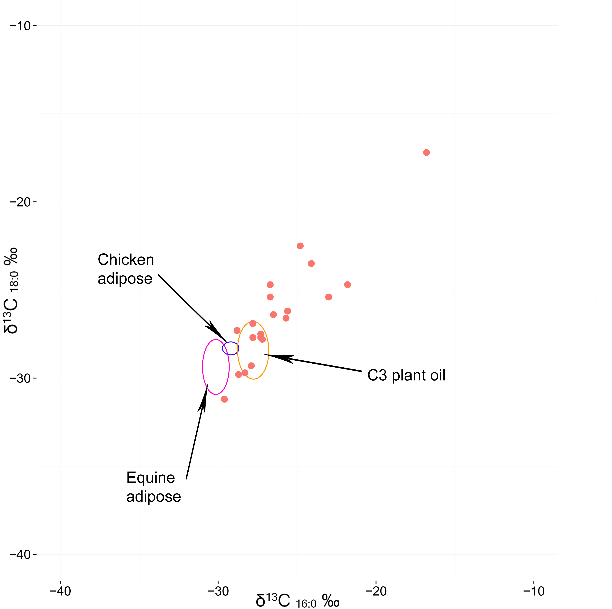
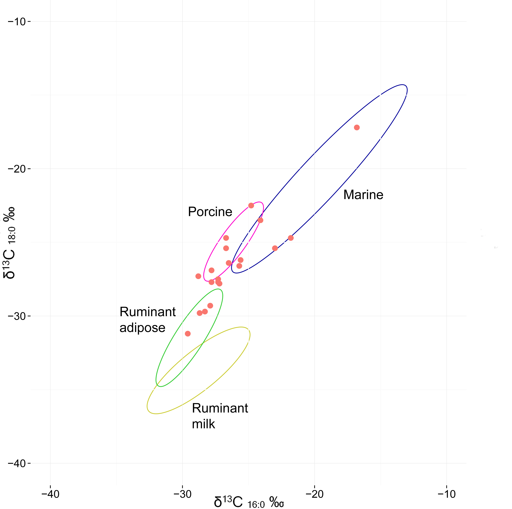
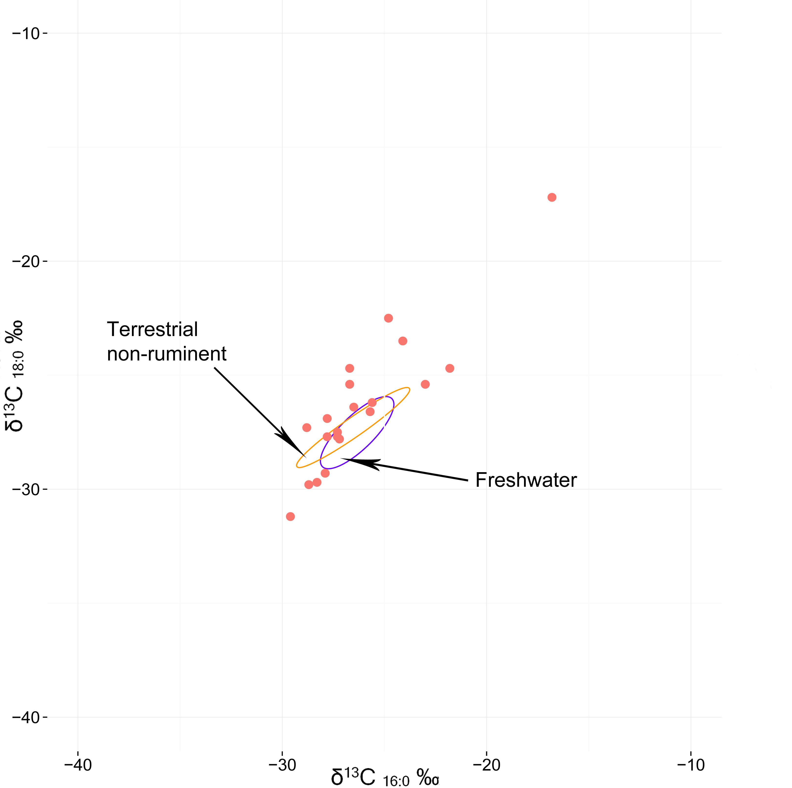
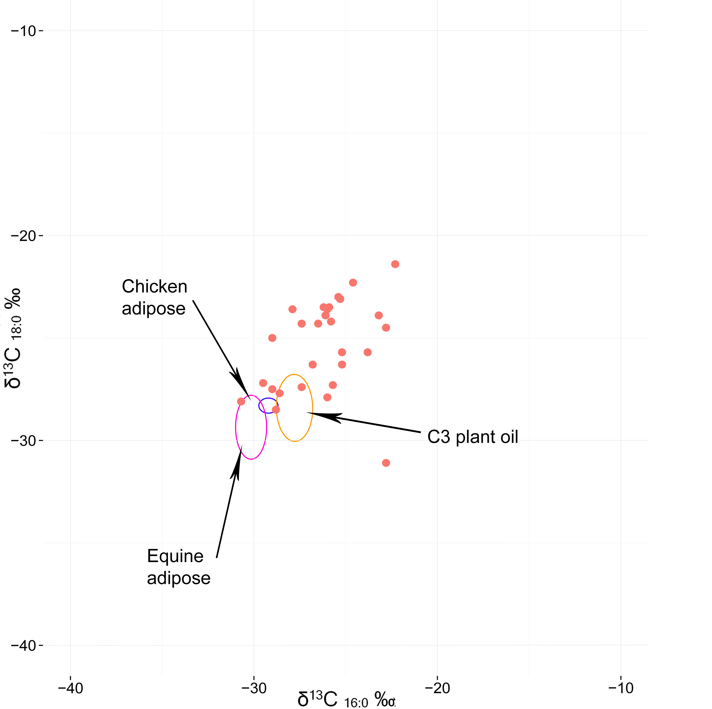
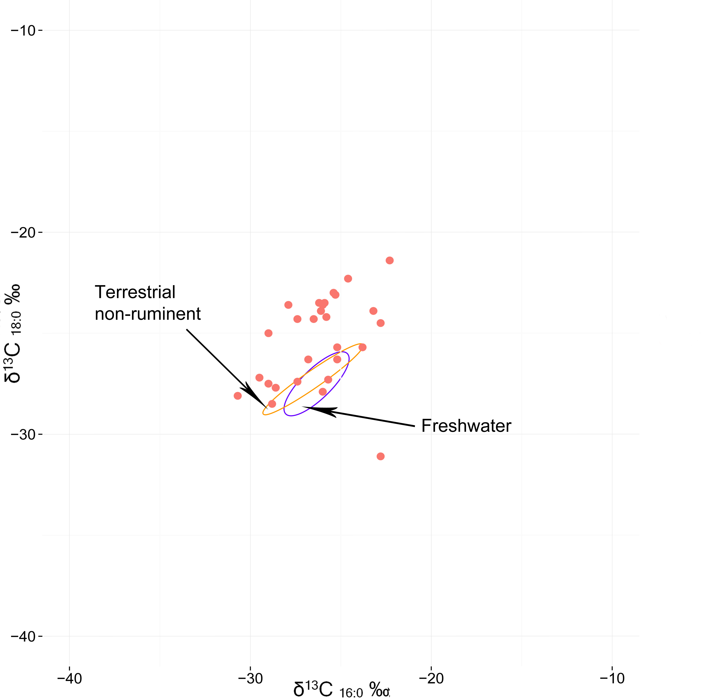
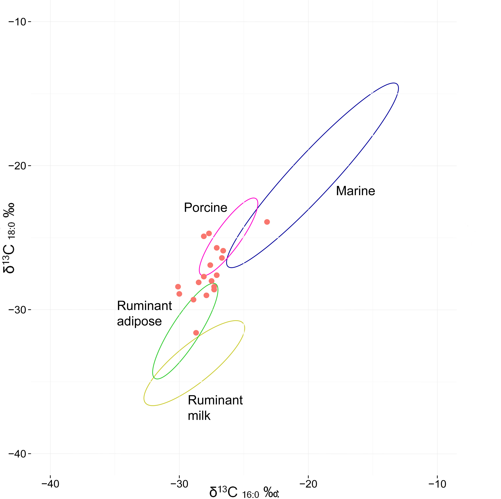
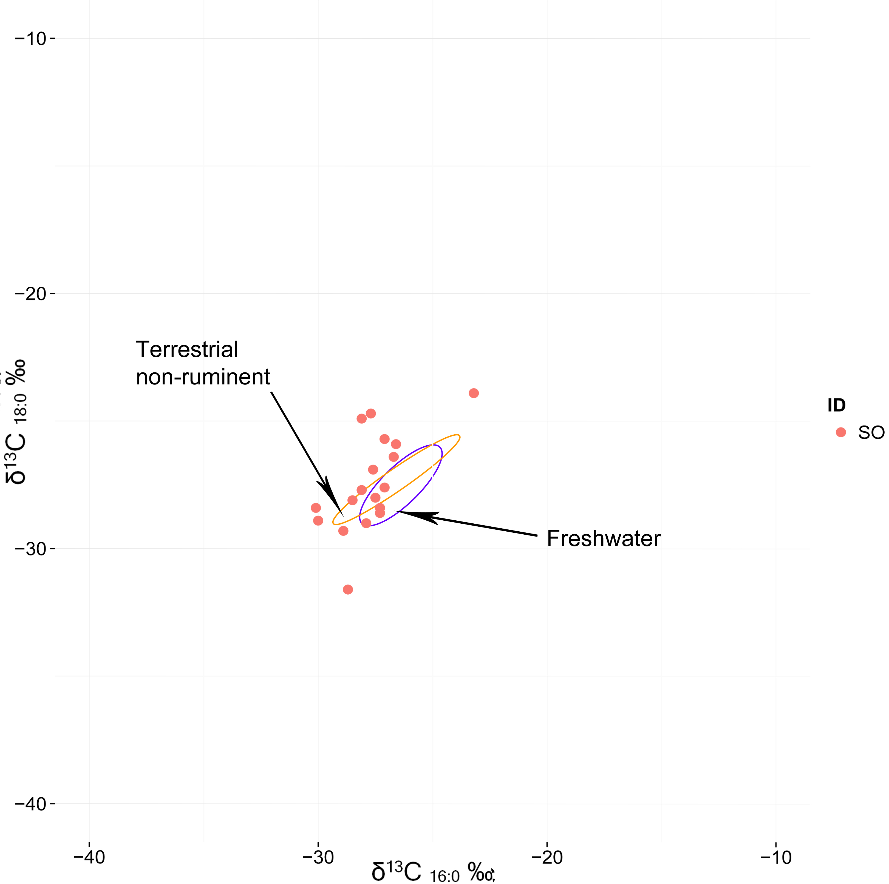
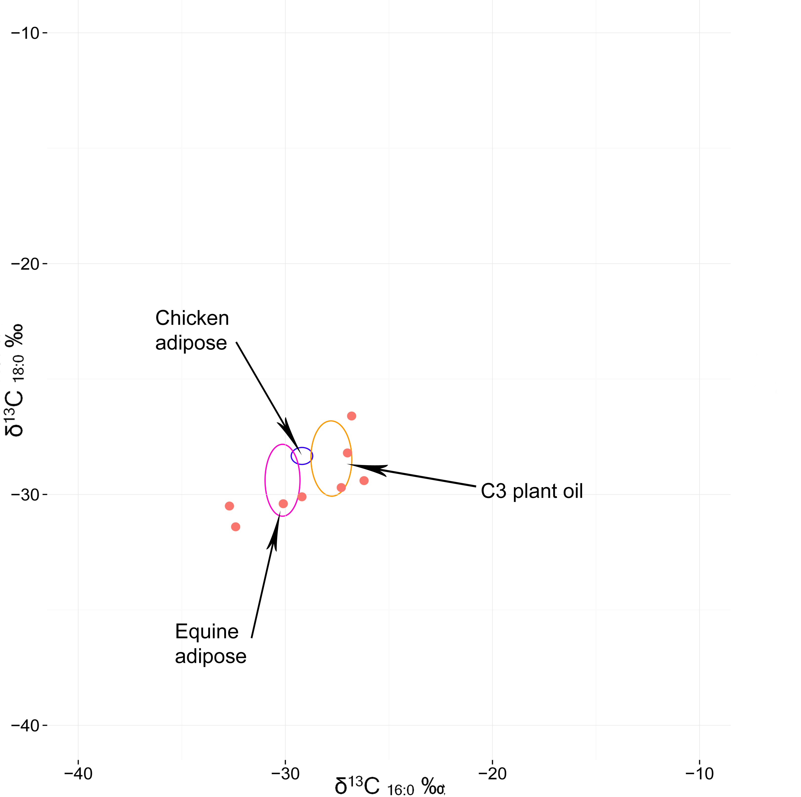

```{r, echo=FALSE, cache=FALSE}
set_parent("thesis.Rmd")
```

\chapter{The Results}

\section{Introduction}

This chapter is dedicated to the results of the organic geochemical analyses and luminescence dating from four different habitation sites in the central part of the Korean peninsula. The overall archaeological phenomena of the four sites will be described in detail. Then, the sampling strategies, methods and the results of the organic geochemical analyses and luminescence dating for the each of the sites will be elucidated one by one.      

\section{Kimpo-Yangchon}
  
The Kimpo-Yangchon site is located on the low hillocks around Guree-Ri, Yoohyeon-Ri, and Yangchon-Ri of Kimpo city, Gyeonggi province. The site is about 4 kilometers southwest of the Han River (Figure \ref{site_locations}; \ref{site_locations_zoomin}). The research period was from October 30th, 2007 to February 25th, 2011. The site includes various archaeological phenomena such as house pits, mound burials, pit graves, stone-lined pit burials, and firing features which represent different time periods from the Chulmun period to the historical Joseon Dynasty (AD 1392 - 1897) [@Kim2013]. The total area of the site is 863,992 square meters. Its main archaeological phenomena belong to the Mumun Period, and the analysis was focused on this time period.

Six house pits and two pit features were classified into the Chulmun period. The house pits are either round-shaped or square-shaped with rounded corners, and hold the interior features such as hearth, four post holes and ditch. Most of the potteries are pointed-bottomed deep bowls with various combinations of patterns including (short) slanted incising, herringbone, and lattice. The excavated house structures are assumed to belong to the late Middle - Late Chulmun Period.

As for the Mumun period, 126 house pits, pit features, and firing features were excavated. The house pits are classified into three types based on their shape: square, rectangular, and long house. Each of those houses normally has an array of multiple post holes which crosses the center of the pit; and some of them comprehend pit-hearths, storage pits, and ditches as interior features. Most of the potteries have the rim-punctuation or a combination of lip-scoring/rim-punctuation; and others a combination of double-rim/short slanted line incision (Figure \ref{Mpatterns}). As for the ground stone tools, arrowheads, daggers, and axes were found. As for the farming tools, semi-lunar shaped stone knives (Figure \ref{KY-artifacts}; cf. Figure \ref{farming}b) and mortar/pestle were found. The excavated features can be reclassified into two different lineages: (large) square/rectangular house pits with double-rim/short slanted line incision potteries and (small) rectangular house pits/(elongated) long houses with rim-punctuation potteries (Figure \ref{Mpatterns}). These two lineages are considered to be an extension of the two Early Mumun pottery cultures (Garak-Dong style and Yeoksam-Dong style) which covers a large extent of Gyeonggi province (Figure \ref{site_locations}). These Mumun features of the site have a great value in understanding the overall aspect of the Mumun Period in the central west part of the Korean Peninsula. Considering the number of houses and artifacts (Figure \ref{KY-artifacts}), and their radiocarbon dating (Table \ref{radiocarbon_KM}), the period when the Kimpo-Yangchon site was occupied the most intensively is around 2,900 - 2,700 BP, the incipient/early stage of the Mumun period.

 Location/house pit No.	  Cultural historical period	 C14 date (BP; uncalibrated)	Calendar date 
------------------------ ----------------------------- ------------------------------ -------------------
 Area 2-1 “B”/No.1	       Mumun	                    2650±50	                       BC 815
 Area 2-1 “B-1”/No.1	   Mumun	                    3010±50	                       BC 1255
 Area 2-1 “B-1”/No.2	   Mumun	                    2540±40	                       BC 770
 Area 1-D /No.22	       Mumun 	                    2770±60	                       BC 910
 Area 1-D /No.23	       Mumun	                    2850±40	                       BC 1005
 Area 2-1 “F”/No.1	       Chulmun	                    4530±50	                       BC 3175
 Area 2-1 “F”/No.2	       Chulmun                  	4550±50	                       BC 3175
 Area 1-G /No.4	           Mumun                    	2700±40	                       BC 835
 Area 1-G /No.2	           Mumun	                    2680±50	                       BC 830
 Area 1-H /No.5	           Mumun                    	2380±40	                       BC 455
 Area 1-H /No.12	       Mumun	                    2770±40	                       BC 935
 Area 2-1 “B-1”/No.3	   Mumun	                    2950±50                 	   BC 1175
 Area 2-1 “J”/No.1	       Mumun	                    2670±40	                       BC 820
 Area 2-1 “J”/No.3	       Mumun	                    2820±50	                       BC 975
 Area 2-1 “J”/No.4	       Mumun	                    2740±50	                       BC 875
 Area 2-1 “J”/No.6	       Mumun	                    2830±50                  	   BC 980
 Area 2-1 “J”/No.9    	   Chulmun	                    4020±50	                       BC 2525
 Area 2-1 “J”/No.10	       Mumun	                    2710±40	                       BC 860
 Area 2-1 “J”/No.12        Mumun	                    2900±50                  	   BC 1100
 Area 2-1 “J”/No.13	       Mumun	                    2650±50                  	   BC 815
 Area 2-1 “J”/No.13	       Mumun	                    2920±50	                       BC 1130
 Area 2-1 “J”/No.16	       Mumun	                    2630±40	                       BC 808
 Area 2-1 “J”/No.18	       Mumun	                    2560±50	                       BC 775
 Area 2-1 “K”/No.1	       Mumun                    	2900±50	                       BC 1100
 Area 2-1 “K”/No.2	       Mumun                    	2630±40	                       BC 808
 Area 1-K /No.3	           Mumun                    	3020±50                  	   BC 1300
 Area 1-L /No.3	           Mumun                    	2960±50	                       BC 1190
 Area 1-L /No.5	           Mumun	                    2750±50	                       BC 885
 Area 1-L /No.6	           Mumun	                    2550±40	                       BC 770
 Area 1-L /No.10	       Mumun	                    2820±50	                       BC 975
 Area 1-L /No.11     	   Mumun	                    2910±50	                       BC 1105
 Area 1-L /No.12           Mumun	                    2820±60                  	   BC 975
 Area 1-L /No.13	       Mumun	                    2750±50                 	   BC 885
 Area 1-L /No.14	       Mumun	                    2800±50	                       BC 955
 Area 1-L /No.15	       Mumun	                    3090±60                 	   BC 1360
 Area 1-L /No.16	       Mumun	                    2990±50                  	   BC 1215
 Area 1-L /No.17	       Mumun	                    2910±50	                       BC 1105
 Area 1-L /No.19      	   Mumun	                    2720±50	                       BC 863
 Area 1-L /No.20	       Mumun	                    2550±50	                       BC 770
 Area 2-3 “Na” /No.1	   Mumun	                    2520±50	                       BC 595
 Area 2-3 “Na” /No.3	   Mumun	                    2660±60	                       BC 845
 Area 2-3 “Na” /No.4  	   Mumun	                    2760±50	                       BC 885
 Area 2-3 “Na” /No.6	   Mumun	                    2680±56	                       BC 830
 Area 2-3 “Na” /No.7	   Mumun	                    2710±50	                       BC 858
 Area 2-3 “Na” /No.8  	   Mumun	                    2920±50	                       BC 1130
 Area 2-3 “Na” /No.15	   Mumun	                    2850±50	                       BC 1010
 Area 2-4 “Ga” /No. 2	   Baekje Kingdom	            1730±80	                       AD 320
 Area 2-4 “Ga” /No. 11	   Baekje Kingdom	            1670±50	                       AD 375
 Area 2-4 “Ga” /No. 13	   Baekje Kingdom	            1670±60	                       AD 375
 Area 2-4 “Ga” /No. 8	   BaekJe Kingdom	            1880±60	                       AD 145		 
 
Table 5.1. The results of AMS radiocarbon dating of the Kimpo-Yangcho site [@Kim2013]

```{r table_example, results='asis', echo=FALSE}
# read in the CSV file from /data
example_tab <- read.csv("data/radiocarbon_KM.csv")
# for details of table formatting, see http://cran.r-project.org/web/packages/xtable/vignettes/xtableGallery.pdf
print(xtable(example_tab, 
             size="footnotesize", 
             caption="The results of AMS radiocarbon dating of the Kimpo-Yangcho site [@Kim2013]", 
             label="radiocarbon_KM"),
      include.rownames=FALSE,
      booktabs = TRUE,
      floating = FALSE, 
      tabular.environment='longtable'
      )
```


\subsection{Sampling}

\subsubsection{Organic geochemical analyses}

At least two samples were collected from each of the houses, except those which did not yield pottery, and of which the date could not be estimated. If available, three samples were collected from one house. One sample was collected from some house pits which did not yield enough potsherds. Researches have showed that the potteries for ordinary day-to-day subsistence around this period tend to have rather monotonous characteristics in terms of shape and size [@Bae2007; @Shoda2008]. Therefore, the shape and size of the potteries were relatively not critical issues for sampling. According to the experimental analysis of Evershed [@Evershed2008], the rim and upper body parts of pots are where organic residues are the most concentrated after cooking [cf. @Barker2012; @Eerkens2007]. Ethnographic observations showed that generally, high-temperature boiling is regarded as a particularly effective cooking method in the preparation of faunal and floral resources in pots [@Crown1995; @Stahl1989; @Wandsnider1997]. During this process, convection currents of boiling water push extracted lipids from food stuffs to the pot wall. Since lipids float on water, they tend to accumulate and penetrate into the wall of the upper body and rim of the pot. Taking these facts as criteria, a total of 49 samples were collected (Table \ref{sampling_OG_KM}).


 Sample No.	 Location/house pit No.	 Part 	C14 date (BP; uncalibrated)   
----------- ----------------------- ------ ----------------------------- 
 KIM030	     Area 2-3 “Na”/No.3	     Body	2660±50 	
 KIM031	     Area 2-3 “Na”/No.3	     Body		
 KIM032	     Area 2-3 “Na”/No.7	     Body	2710±50 	
 KIM033	     Area 2-3 “Na”/No.7	     Body	2710±50 	
 KIM034	     Area 2-3 “Na”/No.7	     Body	2760±50 	
 KIM035	     Area 2-3 “Na”/No.8	     Body	2920±50 	
 KIM036	     Area 2-3 “Na”/No.8	     Body	2920±50 	
 KIM037	     Area 2-3 “Na”/No.8	     Body	2920±50 	
 KIM038	     Area 2-3 “Na”/No.11	 Body		                          
 KIM039	     Area 2-1 “L”/No.3	     Body	2960±50	
 KIM040	     Area 2-1 “L”/No.3	     Body   2960±50	
 KIM041	     Area 2-1 “L”/No.3	     Body	2960±50	
 KIM042	     Area 2-1 “L”/No.10	     Rim	2820±50 	                  
 KIM043      Area 2-1 “L”/No.10	     Body	2820±50 	                  
 KIM044   	 Area 2-1 “L”/No.11	     Body	2910±50 	                  
 KIM045	     Area 2-1 “L”/No.11      Body	2910±50 	
 KIM046	     Area 2-1 “F”/No.1	     Body	4530±50 (Chulmun)	
 KIM047	     Area 2-1 “F”/No.1	     Body	4530±50 (Chulmun)	
 KIM048    	 Area 2-1 “B-1”/No.1     Body		
 KIM049	     Area 2-1 “D”/No.14	     Body		                         
 KIM050	     Area 2-1 “D”/No.14	     Body		
 KIM051	     Area 2-1 “D”/No.8	     Body		                         
 KIM052	     Area 2-1 “D”/No.8	     Body		                         
 KIM053	     Area 2-1 “D”/No.9	     Body		
 KIM054	     Area 2-1 “D”/No.9	     Body		
 KIM055	     Area 2-1 “D”/No.15      Body		
 KIM056	     Area 2-1 “D”/No.15	     Body		
 KIM057	     Area 2-1 “L”/No.3	     Body		                         
 KIM058	     Area 2-1 “D”/No.10	     Body		
 KIM059	     Area 2-3 “NA”/No.5	     Body		                         
 KIM060	     Area 2-3 “NA”/No.5	     Body	                             
 KIM061	     Area 2-1 “G”/No.3	     Body	                             
 KIM062	     Area 2-1 “G”/No.3	     Body		                         
 KIM063    	 Area 2-1 “H”/No.5	     Body	 2380±40	
 KIM064	     Area 2-1 “H”/No.5	     Body	 2380±40	
 KIM065	     Area 2-1 “H”/No.12      Body	 2770±40	
 KIM066	     Area 2-1 “H”/No.12	     Body	 2770±40	
 KIM067	     Area 2-1 “H”/No.20	     Body		
 KIM068	     Area 2-1 “H”/No.20	     Body		
 KIM069	     Area 2-4 “Ra”/No.20	 Body		                         
 KIM070	     Area 2-3 “Na”/No.3	     Body		
 KIM071	     Area 2-1 “B-1”/No.3	 Body		                         
 KIM072	     Area 2-1 “D”/No.14      Body		                         
 KIM073	     Area 2-1 “G”/No.5	     Rim		                         
 KIM074	     Area 2-1 “G”/No.5	     Body		
 KIM075	     Area 2-1 “J”/No.1	     Body		                         
 KIM076	     Area 2-1 “L”/No.1	     Body		                         
 KIM077	     Area 2-1 “D”/No.9	     Body		                         
 KIM078	     Area 2-1 “L”/No.9	     Rim		                         
 
Table 5.2. The samples collected from the Kimpo-Yangchon site for the organic geochemical analyses in this thesis

```{r table_example, results='asis', echo=FALSE}
# read in the CSV file from /data
example_tab <- read.csv("data/sampling_OG_KM.csv")
# for details of table formatting, see http://cran.r-project.org/web/packages/xtable/vignettes/xtableGallery.pdf
print(xtable(example_tab, 
             size="footnotesize", 
             caption="The samples collected from the Kimpo-Yangchon site for the organic geochemical analyses in this thesis", 
             label="sampling_OG_KM"),
      include.rownames=FALSE,
      booktabs = TRUE,
      floating = FALSE, 
      tabular.environment='longtable'
      )
```

\subsubsection{Luminescence dating}
For the luminescence dating two samples were collected to see if there would be positive correlations between the luminescence dates and published AMS radiocarbon dates [Table 5.1, @Kim2013]. Both of the samples were collected from the house that has not been dated (Table \ref{sampling_LM_KM}).

Sample No.	Location/house pit No.  Part   Depth (m)
---------- ----------------------- ------ ------------
U3045        Area 2-1 “L”/No.3      Body    0.3
U3046        Area 2-1 “D”/No.10     Body    0.3

Table 5.3. The samples collected from the Kimpo-Yangchon site for the luminescence dating in this thesis

```{r table_example, results='asis', echo=FALSE}
# read in the CSV file from /data
example_tab <- read.csv("data/sampling_LM_KM.csv")
# for details of table formatting, see http://cran.r-project.org/web/packages/xtable/vignettes/xtableGallery.pdf
print(xtable(example_tab, 
             size="footnotesize", 
             caption="The samples collected from the Kimpo-Yangchon site for the luminescence dating in this thesis", 
             label="sampling_LM_KM"),
      include.rownames=FALSE,
      booktabs = TRUE,
      floating = FALSE, 
      tabular.environment='longtable'
      )
```

\subsection{Organic geochemical results}

Before collecting 49 samples from the Kinpo-Yangchon site for the organic geochemical analysis in this thesis, 25 samples were collected for a preliminary analysis. They were all collected based on the same criteria that were mentioned in the “sampling” section. The purpose of the preliminary analysis is to ascertain the applicability of the organic geochemical analyses to examining the potteries from the central part of the Korean Peninsula. The samples were analyzed in accordance with the well-known standard solvent extraction protocol that demands the use of solvent mixture (chloroform–methanol 2 : 1 v/v; cf. chapter 4), at the organic geochemistry unit, University of Bristol, under the guidance of Dr. Richard P. Evershed. Unfortunately, since the lipid concentration of the samples were so low, I was not able to extract an analyzable amount of lipids from those 25 samples (cf. Figure \ref{protocol}a). Following Dr. Evershed’s suggestion, the direction of examination was changed to employ the methanolic acid extraction protocol [@Correa-Ascencio2014, cf. chapter 4].In this thesis, all the 49 samples from the Kimpo-Yangchon site were analyzed by the acid extraction protocol. 

Table \ref{CSIA_KM} and Figure \ref{CSIAKimpo}, \ref{CSIAKM2}, and \ref{CSIAKM3} show the results of the organic geochemical analyses. Among the 49 samples, I was able to analyze 20. 29 samples had to be omitted mainly due to contamination and low concentration of lipids. In spite of going through the cleaning process of samples using drill bits to minimize contamination, in accordance with the standard protocol (cf. Chapter 4), not all the sherds were suitable for the analyses. This is mainly because of poor handling of the pottery during the excavation and curation processes. Generally, the most frequently observed compounds in archaeological lipid residues are palmitic (C16:0) and stearic (C18:0) fatty acids [@Evershed2008]. As expected, the organic compounds of all samples were dominated by those two saturated fatty acids. This means those organic compounds were highly degraded in soil during several thousand years of post-depositional processes (cf. Chapter 4). Nevertheless, with the results of GC-MS analysis, I was able to identify both major short- and long-chain (un)saturated fatty acids including C14:0, C15:0, C15:1, C17:0, C18:1, C20:0, C22:0, C22:2, and C24:0.

--------------------------------------------------------------------------------------------------------------------------------------------
Sample No.	  Compound detected	                          C16:0($\delta$^13^C)	 C18:0($\delta$^13^C)	  Interpretation via CSIA and GC-MS
----------- -------------------------------------------  ---------------------- ---------------------- -------------------------------------
KIM038       C14:0, C15:0, C15:1, C16:0, C16:1, C17:0,       -29.6	               -31.2	              Ruminant adipose
             C18:0, C18:1, C19:0, C20:0, C21:0, C22:0, 
	         C24:0	
			 
KIM042	     C14:0, C16:0, C17:0, C18:0, C20:0, C20:1,       -28.8	               -27.3                  Not identifiable
             C22:0, C24:0
			 
KIM043	     C16:0, C17:0, C18:0, C20:0, C22:0	             -26.7	               -25.4	              Pork adipose

KIM044	     C14:0, C15:0, C16:0, C16:1, C17:0,              -25.6	               -26.2	              Aquatic resource  
             C18:0, C20:0, C24:0	                                                                      and/or Pork adipose
			 
KIM049	     C14:0, C15:0, C16:0, C17:0, C18:0, C24:0	     -16.8	               -17.2	              Marine and/or C4 plants 

KIM051	     C14:0, C15:0, C16:0, C16:1, C17:0, C18:0,       -27.8	               -27.7	              Pork adipose   
             C19:0, C20:0, C22:0, C23:0, C24:0	                                                          and/or C~3~ plant oil
			 
KIM052	     C16:0, C18:0, C22:2 	                         -27.9	               -29.3	              Ruminant adipose and/or 
                                                                            		                      C~3~ plant oil
																					  
KIM057	     C15:0, C16:0, C17:0, C18:0, C20:0, C20:1	     -24.8	               -22.5	              Pork adipose

KIM059	     C14:0, C15:0, C16:0, C17:0, C18:0, C19:0,       -27.3	               -27.7	              Not identifiable
             C20:0, C24:0	
			 
KIM060	     C14:0, C15:0, C16:0, C17:0, C18:0, C18:1,       -26.7	               -24.7	              Pork adipose
             C19:0, C20:0, C20:1, C22:0, C24:0	
			 
KIM061	     C14:0, C16:0, C18:0, C20:0, phytanic acid	     -23.0	               -25.4	              Marine 

KIM062	     C16:0, C18:0	                                 -27.8	               -26.9	              Pork adipose and/or 
                                                                                                          C~3~ plant oil

KIM069	     C16:0, C17:0, C18:0, C20:0	                     -25.7	               -26.6	              Aquatic resource 
                                                                                                          and/or Pork adipose
																					  
KIM071	     C16:0, C18:0	                                 -28.7	               -29.8	              Ruminant adipose

KIM072	     C16:0, C18:0	                                 -28.3	               -29.7	              Ruminant adipose  
                                                                                                          and/or C~3~ plant oil
																					  
KIM073	     C14:0, C16:0, C17:0, C18:0	                     -27.2	               -27.8	              Pork adipose and/or 
                                                                                                          C~3~ plant oil

KIM075	     C14:0, C15:0, C16:0, C17:0, C18:0, C20:0,       -24.1	               -23.5                  Marine and/or 
             C20:1	                                                                                      Pork adipose
			 
KIM076	     C14:0, C16:0, C17:0, C18:0, C20:0	             -26.5	               -26.4	              Pork adipose

KIM077	     C14:0, C16:0, C18:0	                         -27.3	               -27.5	              Not identifiable

KIM078	     C14:0, C16:0, C18:0, C20:0	                     -21.8	               -24.7	              Marine
---------------------------------------------------------------------------------------------------------------------------------------
Table 5.4. The results of the organic geochemical analysis by GC-MS and GC-C-IRMS of the samples from the Kimpo-Yangchon site, and their interpretations

```{r table_example, results='asis', echo=FALSE}
# read in the CSV file from /data
example_tab <- read.csv("data/CSIA_KM.csv")
# for details of table formatting, see http://cran.r-project.org/web/packages/xtable/vignettes/xtableGallery.pdf
print(xtable(example_tab, 
             size="footnotesize", 
             caption="The results of the organic geochemical analysis by GC-MS and GC-C-IRMS of the samples from the Kimpo-Yangchon site, and their interpretations", 
             label="CSIA_KM"),
      include.rownames=FALSE,
      booktabs = TRUE,
      floating = FALSE, 
      tabular.environment='longtable'
      )
```

There are compounds which are only found in certain food groups. Especially, phytanic acid (3,7,11,15-tetramethylhexadecanoic acid) and 4,8,12-TMTD (4,8,12-trimethyltridecanoic acid) are isoprenoid compounds which mostly are found in particularly high concentrations in marine animals [@Evershed2008b; cf. Chapter 4]. Along with thermally produced long-chain ω-(o-alkylphenyl)alkanoic acids, these compounds are indicators of aquatic/marine resources [@Craig2011; @Evershed2008b]. Since the Kimpo-Yangchon site is only 4 kilometers apart from the Han river (Figure \ref{site_locations_zoomin}), it is essential to know whether its dwellers relied on aquatic resources. Among those 20 samples, one samples showed the presence of phytanic acid (KIM061), indicating the possibility that those pots were used for processing aquatic resources.  
	
The result of isotope analysis (Figure \ref{CSIAKimpo}; \ref{CSIAKM2}; \ref{CSIAKM3}) effected on palmitic (C16:0) and stearic (C18:0) fatty acids on the samples show more interesting characteristics of these ancient farmers’ diet. They indicate that they consumed various food stuffs including pork, C~3~ plants, ruminants, and aquatic resources (Fresh water and Marine). Many samples indicate that the pots from which they came were used for processing multiple foodstuffs. The dominant food classes were pork and aquatic resources, which occupied respectively nine and six samples, that is, about 45 and 30 percent of all the samples. 

The result of CSIA on KIM061 agreed with that of GC-MS analysis, indicating the pot was used for processing marine resources. 25 percent (five samples) shows presence of C~3~ plant oils. However, it has to be carefully considered whether this means rice occupied about one-fourth of those farmers’ diet. Firstly, C~3~ plants include not only rice, but also legumes and barley. As G. Lee (2011) mentioned, we have pollen data from 5,500 BP to 2,600 BP showing the ancient farmers of the Korean peninsula utilized soybean (Glycine max) and azuki (Vignaaugularis) as subsistence resources. Therefore, it is impetuous to argue that the detected C~3~ plant oils are from rice alone. Secondly, since the area of C~3~ plant oils in Figure \ref{CSIAKimpo} could indicate the mixture of pork and ruminant adipose (cf. Chapter 4), we do not have any assurance that the C~3~ plant oils of which the presence is indicated by those five samples are actually plant oil. Lastly, all of the samples identified as revealing C~3~ plant oils are also interpreted as containing pork and ruminant adipose, for the ellipses of C~3~ plant oils and pork adipose overlap each other (Figure \ref{CSIAKimpo} and \ref{CSIAKM2}). Therefore, under this circumstance, what we can draw from the given data is that ‘at most’, rice occupied about one-fourth of the diet of the ancient farmers at the Kimpo-Yangchon site.  








\subsection{Luminescence dating results}

The samples were dated using TL, OSL, and IRSL at the luminescence dating lab, University of Washington. Due to the absence of the associated sediments, the dose rate (alpha, beta, and gamma) was measured using the samples themselves.
 
Table \ref{LM_KM} shows the results of the luminescence dating. Though the dates were slightly outside the main occupation period (2,800 - 2,700 BP) of the Kimpo-Yangchon site estimated by the radiocarbon dates, they corresponded overall with the published dates.

--------------------------------------------------------------------------------------------------------------------------
 Lab. No   Depth(m)   Water Content(%)  Dose rate (Gy/ka)    TL (De)          OSL (De)     IRSL (De)      Age
--------- ---------- ----------------- ------------------- --------------- -------------- -------------- -----------------
 U3045      0.30        10.7               5.23±0.49        13.62±3.55      12.82±0.30     11.14±0.43      658±150 BC           
 
 U3046	    0.30	    15.1	           6.88±0.58	    10.79±2.03	    11.77±0.39     10.16±0.44      495±185 BC 
                                                                                                             (OSL)                  
---------------------------------------------------------------------------------------------------------------------------
Table 5.5. The results of the luminescence dating of the potsherd samples from the Kimpo-Yangchon site. Note that the age of U3046 was calculated solely based on the OSL signal due to an abnormally large error term of the TL date (±1538 yr.).

```{r table_example, results='asis', echo=FALSE}
# read in the CSV file from /data
example_tab <- read.csv("data/LM_KM.csv")
# for details of table formatting, see http://cran.r-project.org/web/packages/xtable/vignettes/xtableGallery.pdf
print(xtable(example_tab, 
             size="footnotesize", 
             caption="The results of the luminescence dating of the potsherd samples from the Kimpo-Yangchon site. Note that the age of U3046 was calculated solely based on the OSL signal due to an abnormally large error term of the TL date (±1538 yr.).", 
             label="LM_KM"),
      include.rownames=FALSE,
      booktabs = TRUE,
      floating = FALSE, 
      tabular.environment='longtable'
      )
```

\section{Sosa-Dong}

The Sosa-Dong site is located on the low hill of Sosa-Dong, Pyeongtaek city, Gyeonggi province. The site is about 2.5 kilometers north of the Anseong stream (Figure \ref{site_locations}; \ref{site_locations_zoomin}).The excavation was conducted by Korea institute of Heritage, from September 2004 to September 2006 [@Kim2008]. The site comprehends various archaeological phenomena such as house pits, mound burials, pit graves, pit features and ditches which belong to different time periods from the Mumun period to the historical Joseon Dynasty (AD 1392 - 1897). 

A total of 81 Mumun period house pits were found. Based on the results of the radiocarbon dating of charcoal from the house pits (Table \ref{radiocarbon_SS}), it is inferred that the site goes back to the times as early as the incipient/early stage of the Mumun period, or as late as the middle/late Mumun period. The house pits are classified into four types based on their shape: square, circular, rectangular, and longhouse. The rectangular and longhouse pits were built around the early stage of the Mumun period (2900 - 2700 BP); and the square and circular pits near the late Mumun period (2500 - 2300 BP). The site has a chronological void from 2700 BP to 2500 BP. Some of these houses incorporate hearths, storage pits and ditches as interior features. Most of the potteries have the rim-punctuation or a combination of lip-scoring/rim-punctuation; and others a combination of double-rim/short slanted incision or rim-punctuation/short slanted incision (figure \ref{SS-artifacts}). As for the ground stone tools, arrowheads, daggers, chisels and axes were found (Figure \ref{SS-artifacts}). As for the farming tools, semi-lunar shaped stone knives (Figure \ref{farming}b) and mortars/pestles were found. Especially, carbonized 46 rice (Oryza sativa; Figure \ref{Rice}a) and 31 possible barley (Hodeum vulgare L.; Figure \ref{Rice}b) grains were found inside of one house pit, near the hearth (Area “Ga”/No. 10). 

The overall archaeological phenomena of the Sosa-Dong site are quite similar to those of the Kimpo-Yangchon site. The composition of different types of house pits, potteries and stone artifacts clearly indicate the resemblance between the two sites. Probably one of the most interesting features of the Sosa-Dong site compared with the Kimpo-Yangchon site is carbonized rice and possible barley grains. Considering their ‘burnt’ condition, it is beyond all doubt that rice and barley were cooked for consumption.    
   
Location/house pit No.	 Cultural historical period	  C14 date (BP; uncalibrated)	Calendar date 
----------------------- ---------------------------- ----------------------------- ----------------  
 Area “La”/No. 20 	      Mumun                        3010±60	                     BC 1240 
 Area “Da”/No. 5	      Mumun	                       2990±50	                     BC 1220
 Area “Da”/No. 6	      Mumun	                       2990±50	                     BC 1220
 Area “Ga”/No. 17	      Mumun	                       2950±50	                     BC 1160
 Area “Ga”/No. 7	      Mumun	                       2930±60	                     BC 1150 
 Area “Da”/No. 7	      Mumun 	                   2930±50	                     BC 1150 
 Area “La”/No. 10	      Mumun	                       2900±50	                     BC 1120
 Area “Ga”/No. 2	      Mumun	                       2850±60	                     BC 1060
 Area “Ga”/No. 10	      Mumun	                       2840±50	                     BC 1050
 Area “Ga”/No. 14	      Mumun	                       2850±50	                     BC 1050
 Area “Ga”/No. 16	      Mumun	                       2840±50	                     BC 1050
 Area “Ga”/No. 18	      Mumun	                       2840±50	                     BC 1050
 Area “Ga”/No. 28	      Mumun	                       2850±50	                     BC 1050
 Area “Da”/No. 4	      Mumun	                       2810±50	                     BC 980
 Area “Ga”/No. 20	      Mumun	                       2750±50	                     BC 910
 Area “La”/No. 4	      Mumun	                       2740±50	                     BC 900
 Chronological void
 Area “Ga”/No. 13	      Mumun	                       2550±50	                     BC 670
 Area “La”/No. 7	      Mumun	                       2470±80	                     BC 600
 Area “Ga”/No. 15	      Mumun	                       2470±60	                     BC 590
 Area “Ga”/No. 4	      Mumun	                       2300±50	                     BC 310
 
Table 5.6. The results of AMS radiocarbon dating of the Kimpo-Yangcho site [@Kim2008]

```{r table_example, results='asis', echo=FALSE}
# read in the CSV file from /data
example_tab <- read.csv("data/radiocarbon_SS.csv")
# for details of table formatting, see http://cran.r-project.org/web/packages/xtable/vignettes/xtableGallery.pdf
print(xtable(example_tab, 
             size="footnotesize", 
             caption="The results of AMS radiocarbon dating of the Kimpo-Yangcho site [@Kim2008]", 
             label="radiocarbon_SS"),
      include.rownames=FALSE,
      booktabs = TRUE,
      floating = FALSE, 
      tabular.environment='longtable'
      )
```

 

 

\subsection{Sampling}

\subsubsection{Organic geochemical analyses}

The general sampling strategy for the organic geochemical analyses on the Sosa-Dong site is quite similar to that on the Kimpo-Yangchon site. At least two samples were collected from each of the houses, except those which did not yield pottery, and whose date could not be estimate. If available, three samples were collected from one house. One sample was collected from some house pits that did not yield enough potsherds. The shape and size of the pots were not considered, for the potteries for ordinary day-to-day subsistence around this period tend to have rather monotonous characteristics in terms of shape and size [@Bae2007; @Shoda2008]. Following the criteria of Evershed [-@Evershed2008, Figure \ref{lipidcon}], the rim and upper body parts were chosen and a total of 37 samples were collected (Table \ref{sampling_OG_SS}). 

![Diagram showing the lipid concentration of each body part from the both experimental and archaeological sherd samples [adapted from -@Evershed2008] \label{lipidcon}](figures/lipidcon.jpg) 

Sample No.	  Location/house pit No.    Part    C14 date (BP; uncalibrated)
----------- ------------------------- -------- -------------------------------
 SOS030       Area “La”/No. 14	        Body	
 SOS031	      Area “La”/No. 4	        Body	
 SOS032	      Area “La”/No. 4	        Rim	
 SOS033	      Area “La”/No. 4	        Rim	
 SOS034	      Area “Ga”/No. 7	        Body	    2930±60
 SOS035	      Area “Ga”/No. 10	        Body	    2840±50
 SOS036	      Area “Ga”/No. 10	        Body	    2840±50
 SOS037	      Area “Ga”/No. 14	        Body	    2850±50
 SOS038	      Area “Ga”/No. 14	        Body	    2850±50
 SOS039       Area “La”/No. 11	        Rim	
 SOS040	      Area “La”/No. 11	        Body	
 SOS041	      Area “La”/No. 11	        Body	
 SOS042	      Area “Ga”/No. 23	        Body	
 SOS043	      Area “Ga”/No. 23    	    Body	
 SOS044	      Area “Ga”/No. 24	        Body	
 SOS045	      Area “Ga”/No. 24	        Body	
 SOS046	      Area “Ga”/No. 25	        Body	
 SOS047	      Area “Ga”/No. 25	        Body	
 SOS048	      Area “La”/No. 15	        Rim	
 SOS049	      Area “La”/No. 15	        Rim	
 SOS050	      Area “La”/No. 15	        Rim	
 SOS051	      Area “La”/No. 2	        Body	
 SOS052	      Area “La”/No. 2	        Body	
 SOS053	      Area “La”/No. 5	        Body	
 SOS054	      Area “La”/No. 5	        Body	
 SOS055	      Area “La”/No. 10	        Body	    2900±50
 SOS056	      Area “La”/No. 10	        Rim	        2900±50
 SOS057	      Area “La”/No. 19	        Body	
 SOS058    	  Area “La”/No. 19	        Body	
 SOS059	      Area “La”/No. 18	        Body	
 SOS060	      Area “La”/No. 18	        Body	
 SOS061	      Area “La”/No. 31	        Body	
 SOS062	      Area “La”/No. 31	        Body	
 SOS063	      Area “La”/No. 31	        Body	
 SOS064	      Area “La”/No. 32	        Body	
 SOS065	      Area “La”/No. 32	        Body	
 SOS066	      Area “La”/No. 36	        Body	
 
Table 5.7. The samples collected from the Sosa-Dong site for the organic geochemical analyses in this thesis

```{r table_example, results='asis', echo=FALSE}
# read in the CSV file from /data
example_tab <- read.csv("data/sampling_OG_SS.csv")
# for details of table formatting, see http://cran.r-project.org/web/packages/xtable/vignettes/xtableGallery.pdf
print(xtable(example_tab, 
             size="footnotesize", 
             caption="The samples collected from the Sosa-Dong site for the organic geochemical analyses in this thesis.", 
             label="sampling_OG_SS"),
      include.rownames=FALSE,
      booktabs = TRUE,
      floating = FALSE, 
      tabular.environment='longtable'
      )
```

\subsubsection{Luminescence dating}

As at the Kimpo-Yangchon site, two samples were collected for the luminesce dating to see if there would be positive correlations between its results and the published AMS radiocarbon dates [@Kim2008, Table 5.6]. One of the two samples was collected from a house which had been dated by the radiocarbon dating, and the other from another which has not been (Table \ref{sampling_LM_SS}). 

Sample No.	  Location/house pit No.	Part	 Depth (m)
----------- ------------------------- -------- -------------
U3042	      Area “La”/No.4	        Body	 0.3
U3043	      Area “La”/No.14	        Body	 0.3

Table 5.8. The samples collected from the Sosa-Dong site for the luminescence dating in this thesis

```{r table_example, results='asis', echo=FALSE}
# read in the CSV file from /data
example_tab <- read.csv("data/sampling_LM_SS.csv")
# for details of table formatting, see http://cran.r-project.org/web/packages/xtable/vignettes/xtableGallery.pdf
print(xtable(example_tab, 
             size="footnotesize", 
             caption="The samples collected from the Sosa-Dong site for the luminescence dating in this thesis", 
             label="sampling_LM_SS"),
      include.rownames=FALSE,
      booktabs = TRUE,
      floating = FALSE, 
      tabular.environment='longtable'
      )
```

\subsection{Organic geochemical results}

As at the Kimpo-Yangchon site, before collecting 37 samples, 21 samples were collected for a preliminary analysis to ensure the analytical protocol. The samples were collected based on the same sampling strategy in this thesis and analyzed by the standard solvent extraction protocol (chloroform–methanol 2 : 1 v/v; cf. chapter 4) at the organic geochemistry unit, University of Bristol. However, it was nearly impossible to extract the lipids from those samples, due to their low concentration (cf. Figure \ref{protocol}a). Under this circumstance, the direction of examination was changed to employ the methanolic acid extraction protocol [@Correa-Ascencio2014, cf. chapter 4]. In this thesis, all the 37 samples from the Sosa-Dong site were analyzed by the acid extraction protocol. 

Table \ref{CSIA_SS}, Figure \ref{CSIASosa}, \ref{CSIASosa2}, and \ref{CSIASosa3} show the results of the organic geochemical analyses. Among the 37 samples, 28 were analyzable. Nine samples had to be omitted mainly due to contamination and low concentration of the lipids. Compared with that of the Kimpo-Yangchon site (20 analyzable samples among 49), this recovery rate is quite high. Considering that there are spatio-temporal similarities between the two sites, their difference in recovery rate of samples probably means the potsherds were more carefully treated during the excavation and curation processes in case of the Sosa-Dong site. 

As I mentioned above, the most frequently observed compounds in archaeological lipid residues are palmitic (C16:0) and stearic (C18:0) fatty acids [@Evershed2008]. The Sosa-Dong site was not an exception, and the organic compounds of all samples were dominated by those two saturated fatty acids, due to the degradation in soil during several thousand years of post-depositional processes. Along with the C16:0 and C18:0 fatty acids, I was able to identify both major short- and long-chain (un)saturated fatty acids including C13:0, C14:0, C15:0, C15:1, C16:1, C17:0, C18:1, C18:2, C20:0, C22:0, C22:1, C23:0, C24:0, and C24:1.

------------------------------------------------------------------------------------------------------------------------------------------
Sample No.	  Compound detected	                          C16:0($\delta$^13^C)	 C18:0($\delta$^13^C)	Interpretation via CSIA and GC-MS
----------- -------------------------------------------  ---------------------- ---------------------- -----------------------------------
 SOS030      C16:0, C18:0                                    -25.7	               -27.3	            Fresh water and/or Marine  
 
 SOS031	     C16:0, C17:0, C18:0	                         -26.0	               -27.9	            Fresh water and/or Marine
			 
 SOS032	     C14:0, C15:0, C16:0, C16:1, C17:0, C18:0, 	     -23.8	               -25.7	            Marine
             C18:2, C22:0, C24:0,  C24:1
			 
 SOS033	     C14:0, C15:0, C15:1, C16:0, C16:1, C17:0,       -22.8	               -31.1	            Not identifiable
             C18:0, C18:2, C22:0, C24:0, C24:1		
			 
 SOS035	     C14:0, C16:0, C18:0, C18:2, C22:1, C24:1	     -29.5	               -27.2	            Not identifiable
 
 SOS036	     C14:0, C16:0, C17:0, C18:0, C18:2, C20:0,       -22.8	               -24.5	            Marine
             C22:0, C22:1, C24:1
			 
 SOS037	     C14:0, C16:0, C16:1, C17:0, C18:0, C18:1,       -28.8	               -28.5	            C~3~ plant oil
             C20:0, C22:1, C24:0, C24:1 	                         
																					  
 SOS038	     C14:0, C14:1, C16:0, C16:1, C17:0, C18:0,       -26.5	               -24.3	            Pork adipose
             C18:2, C19:1, C20:0, C22:0. C22:1, C24:1
			 
 SOS039	     C14:0, C15:0, C16:0, C17:0, C18:0, C19:0,       -30.7	               -28.1	            Equine adipose
             C20:0, C22:0, C22:1, C24:1
			 
 SOS040	     C14:0, C16:0, C16:1, C17:0, C18:0, C18:2,       -26.2	               -23.5	            Pork adipose
             C20:0, C22:0, C22:1, C24:0, C24:1
			 
 SOS041	     C14:0, C16:0, C18:0, C20:0, C22:0, C22:1,       -26.0	               -23.6	            Pork adipose
             C24:0, C24:1	
			 
 SOS042	     C14:0, C14:1, C16:0, C16:1, C17:0, C18:0,       -23.2	               -23.9	            Marine
             C18:2, C20:0, C22:0, C22:1, C23:0, C24:0, 
			 C24:1
			 
 SOS043	     C14:0, C16:0, C16:1, C18:0, C18:1, C18:2,       -26.8	               -26.3	            Pork adipose
             C19:1, C22:0, C22:1, C23:0, C24:1
			 
 SOS045	     C14:0, C16:0, C18:0, C18:2, C22:1, C24:1 	     -28.6	               -27.7	            C~3~ plant oil
 
 SOS047	     C14:0, C16:0, C18:0, C18:2, C22:1, C24:1	     -29.0	               -27.5	            C~3~ plant oil
 
 SOS048	     C14:0, C16:0, C16:1, C17:0, C18:0, C18:1,       -26.1	               -23.9	            Pork adipose
             C18:2, C22:0, C22:1, C24:1
			 
 SOS049	     C16:0, C18:0, C19:0, C20:0, C22:0, C24:0,       -27.4	               -24.3	            Pork adipose
             C24:1, phytanic acid	                                                                    and/or aquatic resources 
			 
 SOS050	     C14:0, C16:0, C16:1, C17:0, C18:0, C18:2,       -27.9	               -23.6	            Not identifiable
             C20:0, C22:0, C22:1, C23:0, C24:0, C24:1
		
 SOS051	     C14:0, C16:0, C16:1, C17:0, C18:0, C18:1,       -22.3	               -21.4	            Marine
             C18:2, C19:0, C22:0. C22:1, C24:1 		
			 
 SOS054	     C14:0, C16:0, C16:1, C17:0, C18:0, C18:2,       -25.2	               -25.7	            Fresh water and/or Marine
             C22:0, C22:1, C24:1
	
 SOS055	     C14:0, C16:0, C16:1, C18:0, C18:1, C22:1,       -27.4	               -27.4	            C~3~ plant oil
             C24:1	                                                                                    and/or Pork adipose
			
 SOS056	     C14:0, C16:0, C17:0, C18:0, C18:2, C19:0,       -24.6	               -22.3	            Pork adipose
             C19:1, C20:0, C20:2, C21:0, C22:0, C22:1,                                                  and/or aquatic resources
             C23:0, C24:0, C24:1, phytanic acid
			
 SOS057	     C14:0, C16:0, C18:0, C18:2, C20:0, C22:0,       -25:4	               -23:0	            Pork adipose
             C22:1, C24:0, C24:1 		
			 
 SOS058	     C14:0, C16:0, C17:0, C18:0, C18:2, C19:0,       -29.0	               -25.0	            Not identifiable
             C20:0, C22:0, C22:1, C24:0, C24:1	
			 
 SOS060	     C14:0, C16:0, C18:0, C18:2, C22:1, C24:1	     -25.8	               -24.2	            Pork adipose

 SOS062	     C14:0, C16:0, C17:0, C18:0, C18:2, C19:0,       -25.9	               -23.5	            Pork adipose
             C20:0, C22:0, C22:1, C24:0, C24:1
			 
 SOS063	     C13:0, C14:0, C14:1, C15:0, C15:1, C16:0,       -25.3	               -23.1	            Pork adipose
             C16:1, C17:0, C18:0, C18:2, C19:0, C19:1,
             C20:0, C20:2, C21:0, C22:0, C22:1, C23:0, 
			 C24:0, C24:1
			 
 SOS064	     C14:0, C16:0, C16:1, C17:0, C18:0, C18:1,       -25.2	               -26.3	            Fresh water and/or Marine
             C18:2, C22:1, C24:1	                    
--------------------------------------------------------------------------------------------------------------------------------------
Table 5.9. The results of the organic geochemical analysis by GC-MS and GC-C-IRMS of the samples from the Sosa-Dong site, and their interpretations

```{r table_example, results='asis', echo=FALSE}
# read in the CSV file from /data
example_tab <- read.csv("data/CSIA_SS.csv")
# for details of table formatting, see http://cran.r-project.org/web/packages/xtable/vignettes/xtableGallery.pdf
print(xtable(example_tab, 
             size="footnotesize", 
             caption="The results of the organic geochemical analysis by GC-MS and GC-C-IRMS of the samples from the Sosa-Dong site, and their interpretations", 
             label="CSIA_SS"),
      include.rownames=FALSE,
      booktabs = TRUE,
      floating = FALSE, 
      tabular.environment='longtable'
      )
```

The geographic location of the Sosa-Dong site is quite similarly to that of the Kimpo-Yangchon site. The site is only 2.5 kilometers apart from the Anseong stream, and also close to the Yellow Sea (Figure \ref{site_locations_zoomin}). This means it is quite possible that the farmers of the Sosa-Dong site performed fishing also. During the excavation of the Sosa-Dong site, a total of 17 net sinkers were found. In this regard, it is essential to know whether the dwellers of the Sosa-Dong site relied on aquatic resources. According to Evershed et al. [-@Evershed2008b], phytanic acid (3,7,11,15-tetramethylhexadecanoic acid), 4,8,12-TMTD (4,8,12-trimethyltridecanoic acid) and thermally produced long-chain ω-(o-alkylphenyl)alkanoic acids are the indicators of aquatic/marine resources [cf. @Craig2011]. Among those 28 samples, two samples showed the presence of phytanic acid (SOS 049, SOS056), indicating the possibility that those pots were used for processing aquatic resources.   

The results of the isotope analysis effected on palmitic (C16:0) and stearic (C18:0) fatty acids on the samples show a varied diet of these ancient farmers. The result (Figure \ref{CSIASosa}; \ref{CSIASosa2}; \ref{CSIASosa3}) indicate that they consumed several food stuffs including pork, aquatic resources, and C~3~ plants. The diet of the ancient dwellers of the Sosa-Dong site was dominated by pork and aquatic (freshwater and marine) resources. About 40 percent of the samples shows the presence of Pork adipose. At most only 14 percent (4 samples) shows the presence of C~3~ plant oil. Considering that 17 net sinkers were found at the site, it is not surprising that about 30 percent (8 samples) indicates the presence of aquatic resources. As a whole, the diet pattern of the Sosa-Dong site is somewhat similar to that of the Kimpo-Yangchon site.   

 




\subsection{Luminescence dating results}

The samples were dated using TL, OSL, and IRSL at the luminescence dating lab, University of Washington. Unfortunately, due to the absence of the associated sediments, the dose rate (alpha, beta, and gamma) was measured using the samples themselves.

Table \ref{LM_SS} shows the results of the luminescence dating. Overall, the dates match with the main occupation period of the Sosa-Dong site estimated by the radiocarbon dates. 

--------------------------------------------------------------------------------------------------------------------------------
 Lab. No   Depth (m)   Water Content (%)  Dose rate* (Gy/ka)     TL (De)          OSL (De)        IRSL (De)       Age
--------- ----------- ------------------ -------------------- --------------- ----------------- -------------- -----------------
 U3042      0.30        18.4                 7.87±0.47	        20.97±1.59	     14.49±0.43	     13.19±0.31	      882±209 BC     
 
 U3043	    0.30	    19.7	             6.66±0.40	        13.99±1.47	     11.96±0.23	     14.18±0.59    	  995±127 BC                   
--------------------------------------------------------------------------------------------------------------------------------
Table 5.10. The results of the luminescence dating of the potsherd samples from the Sosa-Dong site

```{r table_example, results='asis', echo=FALSE}
# read in the CSV file from /data
example_tab <- read.csv("data/LM_SS.csv")
# for details of table formatting, see http://cran.r-project.org/web/packages/xtable/vignettes/xtableGallery.pdf
print(xtable(example_tab, 
             size="footnotesize", 
             caption="The results of the luminescence dating of the potsherd samples from the Sosa-Dong site", 
             label="LM_SS"),
      include.rownames=FALSE,
      booktabs = TRUE,
      floating = FALSE, 
      tabular.environment='longtable'
      )
```

\section{Songguk-Ri}

Among the thousands of prehistoric archaeological phenomena in the Korean peninsula, probably one of the most well-known and thoroughly studied sites is the Songguk-Ri site. Located in Buyeo city, Chungnam province, South Korea, it belongs to the Middle and Late Mumun period (Figure \ref{site_locations}; \ref{site_locations_zoomin}). The initial excavation was conducted in 1975; and Songguk-Ri became the first archaeological site in Korea, which yielded bronze artifacts, tubular greenstone (jade) beads, typical un-patterned pottery and rounded pit-houses with two post holes (Figure \ref{SON-artifacts}). These characteristic rounded pit houses were also found at other archaeological sites of later excavation, along with similar assemblages. It is why archaeologists recognized Songguk-Ri as a certain archaeological type of the Middle Mumun period, and designated both the formers and the latters 'the Songguk-ri Style'. Until now, the site has been excavated 14 times by different branches of the National Museum of Korea and the Korean National University of Cultural heritage [@BuyeoNationalMuseum2000; @NationalMuseumofKorea1979; -@NationalMuseumofKorea1986; @NationalMuseumofKorea1987; @Kim2011; -@Kim2013a].

Groups of pit-houses are found in various spots in an area of almost several square kilometers. The un-patterned potteries excavated from the site were named ‘the Songguk-Ri style pottery’; and potteries of this style were found at many other sites in the central part of the Korean peninsula with typical assemblages. The evidence of a wooden fence around the residential area indicates conflict and competition between the local Mumun societies [@NationalResearchInstituteofCulturalHeritage2002]. A number of smaller settlements presumed to be formed about the same period were found within the radius of several kilometers from Songguk-Ri. The site also comprehends stone-cist burials with a Liaoning-style bronze dagger, large tubular-shaped greenstone ornaments and a ground stone dagger (Figure \ref{SON-artifacts}). The high status materials (e.g. bronze dagger, green stone beads) in stone cist burials at the site and a number of small settlements around it led archaeologists to assume that in Songguk-Ri and its vicinity appeared the earliest form of social hierarchy in the ancient Korean Peninsula. With the importance of the site, it is registered as “Historical Site No. 249 (Cultural heritage Administration of Korea)”.

The latest excavation of the Songguk-Ri site was conducted by the Korean National University of Cultural Heritage. The 12th to 14th excavations were held from April of 2008 to September of 2011 [@Kim2011; -@Kim2013a]. As for the Mumun period, 47 house pits and 34 pit features were found. Based on the results of the radiocarbon dating of charcoal from the house pits and pit features (Table \ref{radiocarbon_SG}), the site was classified into the middle/late Mumun period. The house pits are classified into four types by their shape: circular, square, rectangular. No longhouse was found, for this type existed only during the incipient/early stage of the Mumun period. As for the ground stone tools, arrowheads, semi-lunar shaped stone knives, spindle whorl, and pieces of green stone beads were excavated.  

During the 14th excavation, several kinds of carbonized grains were found at 11 different features including house pits and pit features. The confirmed kinds were rice (Oryza sativa), foxtail millet (Setaria italica), broomcorn millet (Panicum Millaceum), soybean (Glycine max) and azuki (Vigna augularis). The two dominant grains were foxtail millet and rice, which occupied respectively about 65 and 32 percent of the identified ones, (their respective number: 5798 and 2892).

house pit No.	         Cultural historical period	  C14 date (BP; uncalibrated)	Calendar date 
----------------------- ---------------------------- ----------------------------- ----------------  
 No. 2 	                  Mumun                        2430±50	                     BC 475 
 No. 23 		          Mumun	                       2540±50	                     BC 660
 No. 23 	              Mumun	                       2450±40	                     BC 580
 No. 26 	              Mumun	                       2350±60	                     BC 450
 No. 26 	              Mumun	                       2360±50	                     BC 450
 No. 38	                  Mumun	                       2500±60	                     BC 655
 No. 39	                  Mumun	                       2590±50	                     BC 785
 No. 43	                  Mumun	                       2220±60	                     BC 260
 No. 48	                  Mumun	                       2520±50	                     BC 595
 No. 51 	              Mumun	                       2410±40	                     BC 470
 No. 51 	              Mumun	                       2520±40	                     BC 650
 No. 52 	              Mumun	                       2560±40	                     BC 680
 No. 52 	              Mumun	                       2460±40	                     BC 580
 No. 67	                  Mumun	                       2420±40	                     BC 470
 No. 67 	              Mumun	                       2490±50	                     BC 650
 No. 68	                  Mumun	                       2440±40	                     BC 580
 No. 70	                  Mumun	                       2410±40	                     BC 470
 No. 70	                  Mumun	                       2430±50                     	 BC 580

Table 5.11. The results of the AMS radiocarbon dating of the Songguk-Ri site [@Kim2011; -@Kim2013a]

```{r table_example, results='asis', echo=FALSE}
# read in the CSV file from /data
example_tab <- read.csv("data/radiocarbon_SG.csv")
# for details of table formatting, see http://cran.r-project.org/web/packages/xtable/vignettes/xtableGallery.pdf
print(xtable(example_tab, 
             size="footnotesize", 
             caption="The results of the AMS radiocarbon dating of the Songguk-Ri site [@Kim2011; -@Kim2013a]", 
             label="radiocarbon_SG"),
      include.rownames=FALSE,
      booktabs = TRUE,
      floating = FALSE, 
      tabular.environment='longtable'
      )
```

![(a): some of the artifacts uncovered during the excavation of the Songguk-Ri site: pot, large tubular-shaped greenstone ornaments, semi-lunar shaped stone knife, arrowheads, ground stone dagger, and Liaoning-style bronze dagger [@Lee2003; @Yoon2010] (b): the “Songguk-Ri style” rounded pit-houses with two post holes [@Yoon2010] \label{SON-artifacts}](figures/SON-artifacts.jpg) 

\subsection{Sampling}

\subsection{Organic geochemical analyses}

The samples for the organic geochemical analyses were collected during the 14th excavation of the Songguk-Ri site. The general sampling strategy for the site was somewhat different from that of the Kimpo-Yangchon and Sosa-Dong sites. Since the potsherds from the Songguk-Ri site were quite scarce, all the available ones which were conceded by the institution were sampled for the analysis. Under these circumstances, I have collected a total of 27 samples from 16 house pits and 2 pit features (Table \ref{sampling_OG_SG}). Unfortunately, no rim and upper body parts were selectively collected, for none of the available potsherds came from the rim portion. 

Sample No.	  Location/house pit No.    Part    C14 date (BP; uncalibrated)
----------- ------------------------- -------- -------------------------------
 SON001	      No. 52	               Body	     2560±40, 2460±40
 SON002	      No. 53	               Body	
 SON003	      No. 54	               Body	
 SON004	      No. 60	               Body	
 SON005	      No. 70	               Body	
 SON006	      No. 73	               Body	
 SON007	      No. 77	               Body	
 SON008	      No. 54 (pit feature)	   Body	
 SON009	      No. 59 (pit feature)	   Body	
 SON010	      No. 51	               Body	     2410±40, 2520±40
 SON011	      No. 51	               Body	     2410±40, 2520±40
 SON012	      No. 60	               Body	
 SON013	      No. 60	               Body	
 SON014	      No. 61	               Body	
 SON015	      No. 72	               Body	
 SON016	      No. 72	               Body	
 SON017	      No. 74	               Body	
 SON018	      No. 74	               Body	
 SON019	      No. 52	               Body	     2560±40, 2460±40
 SON020	      No. 53                   Body	
 SON021	      No. 58	               Body	
 SON022	      No. 58	               Body	
 SON023	      No. 59	               Body	
 SON024	      No. 59	               Body	
 SON025	      No. 62	               Body	
 SON026	      No. 63	               Body	
 SON027	      No. 69	               Body	

Table 5.12. The samples collected from the Songguk-Ri site for the organic geochemical analyses in this thesis

```{r table_example, results='asis', echo=FALSE}
# read in the CSV file from /data
example_tab <- read.csv("data/sampling_OG_SG.csv")
# for details of table formatting, see http://cran.r-project.org/web/packages/xtable/vignettes/xtableGallery.pdf
print(xtable(example_tab, 
             size="footnotesize", 
             caption="The samples collected from the Songguk-Ri site for the organic geochemical analyses in this thesis", 
             label="sampling_OG_SG"),
      include.rownames=FALSE,
      booktabs = TRUE,
      floating = FALSE, 
      tabular.environment='longtable'
      )
```

\subsubsection{Luminescence dating}

Unfortunately, no sample was collected for the Luminescence dating. This is due to the scarcity of potsherds unearthed during the 14th excavation. 


\subsection{Organic geochemical results}

Table \ref{CSIA_SG}, Figure \ref{CSIASongguk}, \ref{CSIASongguk2}, and \ref{CSIASongguk3} show the results of the organic geochemical analyses. Among the 27 samples, 18 were analyzable. Nine samples were omitted due to the contamination and low concentration of lipids.  

Generally, the most frequently observed compounds in archaeological lipid residues are palmitic (C16:0) and stearic (C18:0) fatty acids (Evershed 2008a). The Songguk-Ri site was not an exception; and C16:0 and C18:0 fatty acids were the only organic compounds that were detected from all the analyzable 18 samples. Along with C16:0 and C18:0 fatty acids, I was able to identify both major short- and long-chain (un)saturated fatty acids including C13:0, C14:0, C15:0, C15:1, C16:1, C17:0, C18:1, C18:2, C19C20:0, C22:0, C22:1, C23:0, C24:0, and C24:1.

--------------------------------------------------------------------------------------------------------------------------------------------
Sample No.	  Compound detected	                          C16:0($\delta$^13^C)	  C18:0($\delta$^13^C)	  Interpretation via CSIA and GC-MS
----------- -------------------------------------------  ----------------------  ----------------------  -----------------------------------
 SON001      C13:0, C14:0, C14:1, C15:0, C15:1, C16:0,      -28.1	                -24.9	               Possibly Pork adipose
             C16:1, C17:0, C18:0, C18:1, C18:2, C19:0, 
			 C20:0, C20:1, C21:0, C22:0, C22:1, C23:0, 
			 C24:0	
 
 SON002	     C13:0, C14:0, C14:1, C15:0, C15:1, C16:0,      -27.1	                -25.7	               Pork adipose
             C16:1, C18:0, C18:1, C19:0, C20:0, C20:1, 
			 C21:0, C22:0, C22:1, C23:0, C24:0	
			 
 SON003      C13:0, C14:0, C14:1, C15:0, C15:1, C16:0,      -27.1	                -27.6	               Fresh water and/or 
             C16:1, C17:0, C18:0, C18:1, C19:0, C19:1,                                                     C~3~ plant oil
			 C20:0, C20:1, C20:2, C21:0, C22:0, C22:1, 
			 C23:0, C24:0, C24:1	
			 
 SON004	     C13:0, C14:0, C14:1, C15:0, C15:1, C16:0,      -26.6	                -25.9	               Pork adipose
             C16:1, C17:0, C18:0, C18:1, C19:0, C19:1, 
			 C20:0, C20:1, C20:2, C21:0, C22:0, C22:1, 
			 C23:0, C24:0, C24:1	
			 
 SON005	     C13:0, C14:0, C14:1, C15:0, C15:1, C16:0,      -28.7	                -31.6	               Ruminant adipose 
             C16:1, C17:0, C18:0, C18:1, C19:0, C19:1, 
			 C20:0, C20:1, C21:0, C22:0, C22:1, C23:0, 
			 C24:0, C24:1	
 
 SON006	     C13:0, C14:0, C14:1, C15:0, C15:1, C16:0,      -27.6	                -26.9	               Pork adipose
             C16:1, C18:0, C18:1, C18:2, C19:0, C20:0, 
			 C20:1, C21:0, C22:0, C22:1, C23:0, C24:0, 
			 C24:1	
			 
 SON012	     C14:0, C14:1, C16:0, C16:1, C17:0, C18:0,      -28.1	                -27.7	               C~3~ plant oil
             C18:1, C18:2, C20:0, C20:1, C21:0, C22:0, 
			 C22:1, C24:0, C24:1	
																					  
 SON013	     C14:0, C14:1, C15:0, C16:0, C16:1, C17:0,      -26.7	                -26.4	               Pork adipose
             C18:0, C18:1, C18:2, C19:0, C19:1, C20:0, 
			 C20:1, C20:2, C21:0, C22:0, C22:1, C23:0, 
			 C24:0, C24:1	
			 
 SON014	     C13:0, C14:0, C14:1, C15:0, C16:0, C16:1,      -27.9	                -29.0	               Ruminant adipose 
             C17:0, C18:0, C18:2, C22:1, C24:1	                                                           and/or C~3~ plant oil
			 
 SON016      C14:0, C14:1, C15:0, C16:0, C16:1, C17:0,      -27.7	                -24.7	               Possibly Pork adipose
             C18:0, C18:2, C20:0, C22:1, C24:1	
			 
 SON017	     C14:0, C14:1, C15:0, C16:0, C16:1, C17:0,      -27.3	                -28.4	               Fresh water and/or 
             C18:0, C18:2, C22:0, C22:1, C24:0, C24:1	                                                   C~3~ plant oil
			 
 SON018	     C14:0, C14:1, C15:0, C15:1, C16:0, C16:1,      -23.2	                -23.9	               Marine
             C17:0, C18:0, C18:2, C22:0, C22:1, C24:0, 
			 C24:1	
			 
 SON020	     C14:0, C14:1, C15:0, C15:1, C16:0, C16:1,      -27.3	                -28.6	               Fresh water and/or
             C17:0, C18:0, C18:1, C18:2, C19:0, C19:1,                                                     C~3~ plant oil
			 C20:0, C20:1, C20:2, C21:0, C22:0, C22:1, 
			 C23:0, C24:0, C24:1	
			 
 SON022   	 C14:0, C14:1, C16:0, C16:1, C18:0, C18:2,      -28.9	                -29.3	               Ruminant adipose
             C20:0, C22:1, C24:1 	
 
 SON024	     C14:0, C14:1, C16:0, C16:1, C17:0, C18:0,      -27.5	                -28.0	               Fresh water and/or 
             C18:2, C19:0, C20:0, C22:0, C22:1, C23:0,                                                     C~3~ plant oil
			 C24:0, C24:1, phytanic acid	
 
 SON025	     C14:0, C14:1, C16:0, C16:1, C17:0, C18:0,      -30.1	                -28.4	               Equine adipose
             C18:2, C20:2, C21:0, C22:0, C22:1, C24:1	
			 
 SON026	     C14:0, C14:1, C15:0, C16:0, C16:1, C17:0,      -30.0	                -28.9	               Equine adipose
             C18:0, C18:1, C18:2, C22:0, C22:1, C24:1	
			 
 SON027	     C14:0, C16:0, C16:1, C18:0, C18:2, C22:1,      -28.5	                -28.1	               Terrestrial non-ruminant 
             C24:1	                                                                                       and/or C~3~ plant oil
------------------------------------------------------------------------------------------------------------------------------------------
Table 5.13. The results of the organic geochemical analysis by GC-MS and GC-C-IRMS of the samples from the Songguk-Ri site, and their interpretations

```{r table_example, results='asis', echo=FALSE}
# read in the CSV file from /data
example_tab <- read.csv("data/CSIA_SG.csv")
# for details of table formatting, see http://cran.r-project.org/web/packages/xtable/vignettes/xtableGallery.pdf
print(xtable(example_tab, 
             size="footnotesize", 
             caption="The results of the organic geochemical analysis by GC-MS and GC-C-IRMS of the samples from the Songguk-Ri site, and their interpretations", 
             label="CSIA_SG"),
      include.rownames=FALSE,
      booktabs = TRUE,
      floating = FALSE, 
      tabular.environment='longtable'
      )
```

The geographical conditions of the Songguk-Ri site are not drastically different from the Kimpo-Yangchon and Sosa-Dong sites. Not too far away from the Songguk-Ri site is the Geum River, which is about 7 kilometers southwest of it. Therefore, aquatic resources might have chances of having contributed to the diet of its dwellers. In order to fully understand whether these ancient farmers relied on aquatic resources, it is important to examine carefully the presence of aquatic biomarkers such as phytanic acid (3,7,11,15-tetramethylhexadecanoic acid), 4,8,12-TMTD (4,8,12-trimethyltridecanoic acid) and thermally produced long-chain ω-(o-alkylphenyl) [cf. @Craig2011; @Evershed2008b]. Beside detecting phytanic acid from one sample (SON024), no other aquatic biomarkers were identified.

The results of the isotope analysis of C16:0 and C18:0 fatty acids show their characteristic diet. In Songguk-Ri site, the story is a bit different from the former two cases. The results (Figure \ref{CSIASongguk}; \ref{CSIASongguk2}; \ref{CSIASongguk3}) indicate that they consumed several food stuffs including pork, C~3~ plants, aquatic resources (mostly fresh water) and ruminants. The most interesting result is that almost none of the samples indicated the presence of marine resources. This is probably because the distance between the site and the shore nearest to it is much farther than in case of the Kimpo-Yangchon and the Sosa-Dong sites (Figure \ref{site_locations_zoomin}). Therefore, people relied much more on freshwater resources than on the marine ones (Figure \ref{CSIASongguk3}). Also, the result of CSIA on SON024 agreed with that of GC-MS analysis, indicating the pot was used for processing freshwater resources. Pork was still quite a popular foodstuff. Two samples indicated the presence of equine adipose. In Korea, the earliest confirmed evidence of domesticated horse came from several Late Mumun sites dated as early as 2300 BP [@Lee2011; @Lee2009]. Considering that the Songguk-Ri site is classified into the Middle/Late Mumun period, it is quite possible that domesticated/wild horses would have contributed to its dwellers’ diet. As stated above, during the 14th excavation of the Songguk-Ri site, over several thousands of carbonized grains were found. The dominant grains were foxtail millet and rice. Though I was able to show the presence of the C~3~ plant oil which could have originated from rice, none of the samples indicated the presence of millet (C4 plant oil: ^13^C values in the range of –17 to –12.5 ‰; cf. Chapter 4). 

 






\section{Eupha-Ri}

Eupha-Ri is an Iron Age archaeological site in Huengseong city, Gangwon province, South Korea (Figure \ref{site_locations_zoomin}). The Huengseong city council had had a plan to build a cultural/athletic park; and the archaeological investigation had been performed beforehand by the Yonsei University Wonju Museum [@Wang2013]. The excavation was held from May 15th, 2009 to December 11th, 2011. The site comprehends various archaeological phenomena such as house pits, pit features and jar burials which represent different time periods from the Iron Age to the historical Joseon Dynasty (AD 1392 - 1897). The total site area is 23,840 square meters. Its main archaeological features belong to the Iron Age; and this thesis is focusing on this time period.    

36 house pits, 24 pit features, and four jar burials were excavated and classified into the Iron Age. Based on the AMS radio carbon dating applied to the four charcoal samples collected from the house pits, the main occupation period was assumed to be around 1,850 – 1,640 BP (Table \ref{radiocarbon_EP}). The house pits are either “呂” or “凸” shape with rounded corners, and comprehend interior features such as hearth and post holes (Figure \ref{EUPhouse}). This description of their shape is based on the Chinese characters “Lu (呂)” and “Tu (凸)”. The Iron age style hardened un-patterned pottery and that which was made by the beating method were excavated. Other ceramic artifacts were also found, including a mold for iron casting, a net sinker and spindle whorls (Figure \ref{EUPartifact}b). As for Iron ware, axes, daggers and arrowheads were found (Figure \ref{EUPartifact}b).     

Overall, the Eupha-Ri site shows the typical characteristics of the Iron Age sites in the central part of the Korean Peninsula.

house pit No.	         Cultural historical period	  C14 date (BP; uncalibrated)	Calendar date 
----------------------- ---------------------------- ----------------------------- ----------------  
 No. 1	                  Iron Age	                    1850±20	                     AD 188
 No. 15	                  Iron Age	                    1780±20	                     AD 228
 No. 15	                  Iron Age	                    1780±20	                     AD 217
 No. 29	                  Iron Age	                    1640±20	                     AD 336

Table 5.14. The results of the AMS radiocarbon dating of the Eupha-Ri site [@Wang2013]
 
```{r table_example, results='asis', echo=FALSE}
# read in the CSV file from /data
example_tab <- read.csv("data/radiocarbon_EP.csv")
# for details of table formatting, see http://cran.r-project.org/web/packages/xtable/vignettes/xtableGallery.pdf
print(xtable(example_tab, 
             size="footnotesize", 
             caption="The results of the AMS radiocarbon dating of the Eupha-Ri site [@Wang2013]", 
             label="radiocarbon_EP"),
      include.rownames=FALSE,
      booktabs = TRUE,
      floating = FALSE, 
      tabular.environment='longtable'
      )
```
 
\subsection{Sampling}

\subsubsection{Organic geochemical analyses}

Though numerous complete pots were excavated (Figure \ref{EUPartifact}a), not many ‘potsherds’ were found. Since in archaeological investigation, the priority is given to preserving pots in their original form and since it is not common to find lots of complete ones, I was not allowed to take parts from complete ones for the analyses. Under these limited conditions, the samples were collected among the available potsherds found at house pits.      

Thus, a total of 25 samples were collected from eight house pits (Table \ref{sampling_OG_EP}). Though I tried to collect as many samples as I could in the given situation, I have to confess that the eight house pits might not fully represent the entire aspect of the site.  

 

 

Sample No.	  Location/house pit No.    Part                  C14 date (BP; uncalibrated)
----------- ------------------------- ---------------------- -------------------------------
 EUP001	        No. 15	               Rim	                   1780±20
 EUP002	        No. 15	               Rim	                   1780±20
 EUP003	        No. 15	               Rim	                   1780±20
 EUP004	        No. 15	               Rim	                   1780±20
 EUP005	        No. 15	               Rim	                   1780±20
 EUP006	        No. 15	               Rim	                   1780±20
 EUP007	        No. 15	               Rim	                   1780±20
 EUP008         No. 15	               Bottom	               1780±20
 EUP009	        No. 15	               Bottom	               1780±20
 EUP010	        No. 15	               Bottom	               1780±20
 EUP011	        No. 15	               Bottom	               1780±20
 EUP012	        No. 33	               Rim	
 EUP013	        No. 32                 Body	
 EUP014	        No. 32	               Body	
 EUP015	        No. 32	               Body	
 EUP016	        No. 29	               Body (beating method)   1640±20
 EUP017	        No. 15	               Body	                   1780±20
 EUP018	        No. 15	               Rim	                   1780±20
 EUP019	        No. 7.8.9 disturbed	   Rim	
 EUP020	        No. 7.8.9 disturbed	   Rim	
 EUP021	        No. 12	               Rim (beating method)	
 EUP022	        No. 7.8.9 disturbed	   Rim (beating method)	
 EUP030	        No. 33	               Body	
 EUP031	        No. 32	               Body	
 EUP032	        No. 29	               Body	                   1640±20
 
Table 5.15. The samples collected from the Eupha-Ri site for the organic geochemical analyses in this thesis

```{r table_example, results='asis', echo=FALSE}
# read in the CSV file from /data
example_tab <- read.csv("data/sampling_OG_EP.csv")
# for details of table formatting, see http://cran.r-project.org/web/packages/xtable/vignettes/xtableGallery.pdf
print(xtable(example_tab, 
             size="footnotesize", 
             caption="The samples collected from the Eupha-Ri site for the organic geochemical analyses in this thesis", 
             label="sampling_OG_EP"),
      include.rownames=FALSE,
      booktabs = TRUE,
      floating = FALSE, 
      tabular.environment='longtable'
      )
```

\subsubsection{Luminescence dating}

For the luminescence dating three samples were collected to see if there would be positive correlations between the luminescence dates and published AMS radiocarbon dates [@Wang2013, Table 5.14]. Among the three samples, one was collected from the house pit that had been dated by the radiocarbon dating, and the other two from those which had not been (Table \ref{sampling_LM_EP}). 

Sample No.	  Location/house pit No.	Part	 Depth (m)
----------- ------------------------- -------- -------------
U3039	      No. 33	                Body	 0.3
U3040	      No. 32	                Body	 0.3
U3041	      No. 29	                Body	 0.3

Table 5.16. The samples collected from the Eupha-Ri site for the luminescence dating in this thesis

```{r table_example, results='asis', echo=FALSE}
# read in the CSV file from /data
example_tab <- read.csv("data/sampling_LM_EP.csv")
# for details of table formatting, see http://cran.r-project.org/web/packages/xtable/vignettes/xtableGallery.pdf
print(xtable(example_tab, 
             size="footnotesize", 
             caption="The samples collected from the Eupha-Ri site for the luminescence dating in this thesis", 
             label="sampling_LM_EP"),
      include.rownames=FALSE,
      booktabs = TRUE,
      floating = FALSE, 
      tabular.environment='longtable'
      )
```

\subsection{Organic geochemical results}

Table \ref{CSIA_EP}, Figure \ref{CSIAEUP}, \ref{CSIAEUP2} and, \ref{CSIAEUP3} show the results of the organic geochemical analyses. Among the 25 samples, only eight were analyzable. 17 samples were omitted mostly due to the low concentration of the lipids. Like the results in case of the former three sites, palmitic (C16:0) and stearic (C18:0) fatty acids were detected from all the analyzed eight samples. Along with C16:0 and C18:0 fatty acids, I was able to identify both major short- and long-chain (un)saturated fatty acids such as C14:0, C15:0, C16:1, C17:0, C18:2, C19, C20:0, C21:0, C22:0, C22:1, C23:0 and C24:0. The overall lipid concentration of the samples from the Eupha-Ri site was quite low; and the number of the identified fatty acids was much smaller than those at the former three sites. 

This was quite striking, because the Eupha-Ri site is almost 1000 years younger than the other sites (such as Kimpo-Yangchon or Sosa-Dong), and I thought lipids in younger sites had more chances to survive against the post-depositional process than in older ones. The overall low concentration of lipids at the Eupha-Ri site is probably due to the hard fabric of the Iron Age potteries. The surface treatments and a high firing temperature brought into play in manufacturing the Iron Age ceramic vessels would have generated smaller pores, which would have limited the concentration of lipids [cf. @Correa-Ascencio2014]. Otherwise, more lipids could have been absorbed into the vessels. Though Correa-Ascencio and Evershed [-@Correa-Ascencio2014] showed the effectiveness of the methanolic acid extraction on hard and burnished pots, the lipid concentration of the Eupha-Ri site’s potsherds was still low, compared with that which had been observed at more porous Mumun potteries.    

--------------------------------------------------------------------------------------------------------------------------------------------
Sample No.	  Compound detected	                          C16:0($\delta$^13^C)	 C18:0($\delta$^13^C)	  Interpretation via CSIA and GC-MS
----------- -------------------------------------------  ---------------------- ---------------------- -------------------------------------
 EUP005	     C14:0, C15:0, C16:0, C16:1, C17:0, C18:0,      -26.2	               -29.4	             Not identifiable
             C18:2, C19:0, C20:0, C21:0, C22:0, C22:1, 
			 C23:0, C24:0, phytanic acid	
 
 EUP019	     C16:0, C18:0, C20:0, C22:0, C22:1, C24:0	    -29.2	               -30.1	             Ruminant adipose
			 
 EUP020	     C16:0, C18:0, C18:2	                        -32.4	               -31.4	             Not identifiable	
			 
 EUP021	     C16:0, C18:0, C18:2	                        -30.1	               -30.4	             Ruminant adipose 
                                                                                                         and/or Equine adipose 
			 
 EUP022  	 C16:0, C18:0	                                -32.7	               -30.5	             Not identifiable
 
 EUP030	     C14:0, C16:0, C16:1, C18:0, C18:2	            -27.3 	               -29.7	             Ruminant adipose and/or  
			                                                                                             C~3~ plant oil
			   
 EUP031	     C16:0, C17:0, C18:0, C20:0, C22:0	            -26.8	               -26.6	             Pork adipose and/or 
																					                     Fresh water resource 
																					  
 EUP032	     C14:0, C15:0, C16:0, C16:1, C18:0, C18:2	    -27.0	               -28.2	             Ruminant adipose and/or 
                                                                                                         Fresh water resource  
																					                     and/or C~3~ plant oil	
--------------------------------------------------------------------------------------------------------------------------------------------
Table 5.17. The results of the organic geochemical analyses by GC-MS and GC-C-IRMS of the samples from the Eupha-Ri site, and their interpretations

```{r table_example, results='asis', echo=FALSE}
# read in the CSV file from /data
example_tab <- read.csv("data/CSIA_EP.csv")
# for details of table formatting, see http://cran.r-project.org/web/packages/xtable/vignettes/xtableGallery.pdf
print(xtable(example_tab, 
             size="footnotesize", 
             caption="The results of the organic geochemical analyses by GC-MS and GC-C-IRMS of the samples from the Eupha-Ri site, and their interpretations", 
             label="CSIA_EP"),
      include.rownames=FALSE,
      booktabs = TRUE,
      floating = FALSE, 
      tabular.environment='longtable'
      )
```

Geographically, the Eupha-Ri site is just near the Seom River. Therefore, aquatic resources, especially fresh water ones, might have chances of having contributed to its dwellers’ diet. In order to fully understand whether they relied heavily on aquatic resources or not, it is important to carefully examine the presence of aquatic biomarkers such as phytanic acid (3,7,11,15-tetramethylhexadecanoic acid), 4,8,12-TMTD (4,8,12-trimethyltridecanoic acid), and thermally produced long-chain ω-(o-alkylphenyl) [cf. @Craig2011; @Evershed2008b]. Among the eight samples, one samples showed the presence of phytanic acid (EUP005), indicating the possibility that those pots were used for processing aquatic resources.

In the Eupha-Ri site, the diet pattern is quite different from that of the former three cases. The isotope analysis of C16:0 and C18:0 fatty acids shows its interesting aspect. The results of the analysis (Figure \ref{CSIAEUP}; \ref{CSIAEUP2}; \ref{CSIAEUP3}) indicate that the site’s ancient dwellers mainly consumed several food stuffs such as ruminants, C~3~ plants and aquatic resources (fresh water). The most interesting result is that only one sample indicated the presence of pork adipose. Also, almost all samples except two ‘not identifiable’ ones showed the presence of ruminant adipose. This diet pattern focused on ruminants in the Iron Age is quite different from that of the Mumun period in which the pork is dominant. Also, one sample showed the possibility of the presence of equine adipose. During the excavation of the Eupha-Ri site, two molars that belong to horse and cattle were found. In this regards, it is quite possible that people consumed these animals. Two samples showed the possibility of the presence of C~3~ plant oil.              

 


\subsection{Luminescence dating results}

The samples were dated using TL, OSL and IRSL at the luminescence dating lab, University of Washington. Unfortunately, due to the absence of the associated sediments, the dose rate (alpha, beta and gamma) was measured using the samples themselves.

Table \ref{LM_EP} shows the results of the luminescence dating. U3039 and U3041 corresponded to the published four AMS radiocarbon dates (Table 5.14). The date presumed by U3041 indicates that the site was occupied by the Iron Age people slightly longer than the radiocarbon dates suggest. The result of U3040 did not match with both archaeological features of the site and the radiocarbon dates.

--------------------------------------------------------------------------------------------------------------------------------
 Lab. No   Depth (m)   Water Content (%)  Dose rate* (Gy/ka)     TL (De)          OSL (De)        IRSL (De)       Age
--------- ----------- ------------------ -------------------- --------------- ----------------- -------------- -----------------                      
 U3039	    0.30	    14	                 6.38±0.43	       14.67±1.07	    8.13±0.26	     14.65±2.54	     162±114 AD
                                                                                                                  (OSL)
 
 U3040	    0.30	    13.4	             5.34±0.56	       12.3±3.1	        8.97±0.16	     10.04±0.21	     251±122 BC 
 
 U3041	    0.30	    12.6	             6.60±0.30	       7.92±0.60	    8.58±0.19	     8.53±0.33	     517±77 AD  
--------------------------------------------------------------------------------------------------------------------------------- 
Table 5.18. The results of the luminescence dating of the potsherd samples from the Eupha-Ri site. The overall low water content of the samples shows the less porous nature of the Iron Age pottery.

```{r table_example, results='asis', echo=FALSE}
# read in the CSV file from /data
example_tab <- read.csv("data/LM_EP.csv")
# for details of table formatting, see http://cran.r-project.org/web/packages/xtable/vignettes/xtableGallery.pdf
print(xtable(example_tab, 
             size="footnotesize", 
             caption="The results of the luminescence dating of the potsherd samples from the Eupha-Ri site. The overall low water content of the samples shows the less porous nature of the Iron Age pottery.", 
             label="LM_EP"),
      include.rownames=FALSE,
      booktabs = TRUE,
      floating = FALSE, 
      tabular.environment='longtable'
      )
```

\section{Summary}

In this chapter, the focus was given to the results of the organic geochemical analyses and luminescence dating from four different habitation sites in the central part of the Korean peninsula. Firstly, the overall archaeological phenomena of the four sites were described in detail. Then, I elucidated the sampling strategies, methods and the results of the organic geochemical analyses and luminescence dating for the each of the sites one by one. 
