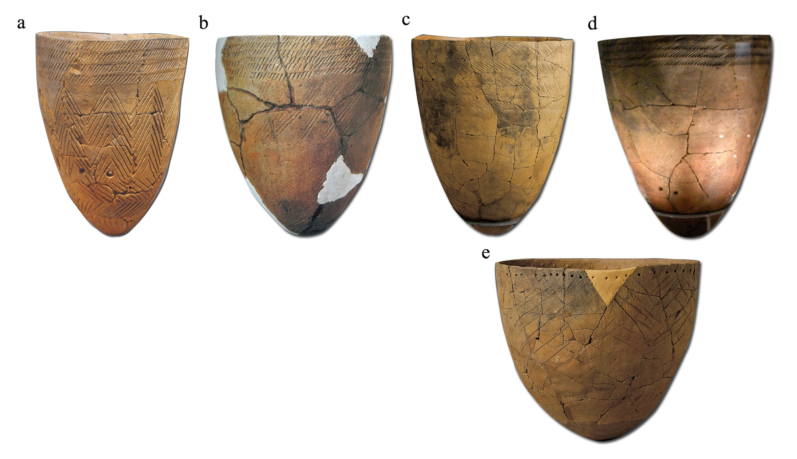

#General Discussion

##6.1 Transition from Chulmun to Mumun: Revisited 
Before I move on to the discussion about the results of organic geochemical analyses and Luminescence dating from the four sites, it is good moment to revisit prevailing concept of the Chulmun and Mumun Period in the Korea archaeology especially focusing on potteries.  As I addressed in chapter 2, there are several key physical traits that make Korean archaeologists to consider discrepancy between the two potteries. For examples, the fundamental characteristics of the Chulmun Period potteries are the comb-shape pattern and the pointed bottom (Figure \ref{CMpottery}a). On the other hand, all the Mumun Period pottery have the flat bottom; the major part of their body does not have any pattern. Some patterns still existed, but confined to the extreme upper body.
   
At first glance it sounds quite reasonable especially when we compare the both extensive and intensive com-shape pattern on Chulmun pottery and mostly un-patterned Mumun pottery (Figure \ref{CMpottery}). However, if we examine closer, there are some variations that have been somewhat undermined.  Until now, probably the most well-known Chulmun Period pottery is the one from Amsa-Dong (Figure \ref{site_locations}; \ref{CMpottery}a). The entire body of the pottery is decorated with comb-shape patterns that can be divided into three different parts (Figure \ref{Cpottery}a). The pattern in each part has different length and angle that makes distinctive characteristic of the pottery. This was the earliest form of the Chulmun pottery in the central part of the Korean peninsula and appeared around 6000 BP. However, the pattern on the Chulmun pottery ‘gradually’ changes as time goes by. Figure \ref{Cpottery}b is the Chulmun period comb-shape patterned pottery found from the younger layer of the Amsa-Dong site. Interestingly enough, pattern on the very bottom part is gone and that of center part became less distinctive. If you see the Late Chulmun Period pottery excavated from the Amsa-Dong site, Seoul city and Sammok island, Incheon city (Figure \ref{Cpottery}c; \ref{Cpottery}d), the pattern on the center part also vanishes away and only top part remains. These latest Chulmun potteries from the Sammok island and Amsa-Dong gives an important clue about the relationship between Chulmun and Mumun, for the pattern in this stage exists only on top and rim. Considering the most distinctive characteristic of the Incipient/Early Mumun potteries is various patterns on their rims (Figure \ref{Mpatterns}c), one can actually find the similarity between the two potteries. Some of the Chulmun potteries even have rim-punctuation (Figure \ref{Cpottery}e) which is commonly observed among the Early Mumun potteries (Figure \ref{Mpatterns}c).  These overall similarities in pattern between late Chulmun pottery and Incipient/Early Mumun potteries suggest close connection between Chulmun and Mumun. All of these evidence contrasts with current dominant idea, which assumes discrepancy between the Chulmun and Mumun Period (B. Kim 2006a; J. Kim 2003; 2006). 

##6.2 The Chulmun and Mumun Period: Essentialism vs. materialism
If you consider these two different perspectives about the relationship between the Chulmun and Mumun pottery with the concept of essentialism versus materialism, the picture is clearer. Essentialism is a philosophical stance that assumes the existence of specific entity that can be both identifiable and distinguishable. If things share actual and fixed characteristics, these essential traits can be used to distinguish a group A from group B. The most prominent point of this ‘essence’ is its unchanging permanency. In contrast, materialism sees phenomena cannot exist as fixed entities because they are always in the process of becoming something else. In materialist’s view, things are in a state of flow: no two things are ever can be put into the same category of group because even similar things are just at similar points in the process of becoming others. In the discipline of biology, the two philosophical stances were identified by Ernst Mayr (1959) to define concepts of biological species: ‘typological’ thinking versus ‘population’ thinking (Marwick 2008; Figure \ref{MvsE}). A key point in differentiating essentialism from materialism is not that the former treats difference and the latter change, but that essentialism treats only difference while materialism traits difference and change (O'Brien and Lyman 1998: 29).

For many years, archaeologists have been studying their sites and artifacts within the framework of ontological essentialism by the name of ‘typology’ or ‘classification’.  Archaeologists often use the terms classification and typology interchangeably, but in here a distinction is made. A classification is any set of formal categories into which a particular field of data is partitioned, while a typology is a particular type of rigorous classification, in which a field of data is divided up into categories that are all defined according to the same set of criteria, and that are mutually exclusive. Therefore, to be precise, it is not classification but typology that many archaeologists have been employing for studying their sites and artifacts. They grouped artifacts according to some characteristics for demonstration of cultural traits and cultural changes. Objects are split into categories —in other word, ‘types’—according to their perceived similarities, and change is viewed as transition from one type to another. This means as long as the objects are in the same category, they are closer to each other than any other objects in different categories (even one category comes right after the other one in terms of time). By doing so, archaeologists have been creating chunks of units for their interpretation of archaeological phenomena. However, there is nothing “inherent” in the unit they use that makes them real (O'Brien and Lyman 1998: 30). Yes. Artifacts may share certain traits in common (that make us to put them in the same category), but there is no reason to think each category is genuine. 

Similar trend have been prevailing in the Korean archaeology, especially when considering transition from Chulmun to Mumun. Whether they recognized or not, the Korean archaeologists created two units and named as “Chulmun pottery” and “Mumun pottery”, regarded the two as different entities. In addition to that, they expanded this concept to entire archaeological phenomena. Since change is viewed as transition from one separate entity (Chulmun) to another (Mumun), everything in the Chulmun period has to be drastically different from that of Mumun, including pottery, house pit, stone artifacts and of course, subsistence strategy. 

I do admit that I have somewhat exaggerated about how Korean archaeologists understand the relationship between Chulmun and Mumun. Also, we have to consider the possibility of sudden and rapid transition from the former to latter that causes actual disconnection between two at least in certain areas by human migration (J. Kim 2003; 2006). However, we already observed the connection between the Chulmun and Mumun through the examination of change in patterns on the potteries excavated from the central part of the Korean peninsula (cf. Figure \ref{Cpottery}). In fact, there were already some recognitions about the similarities between the patterns on the potteries from the two periods (S. Shin 2007). Nevertheless, many archaeologists in Korea still excavate and investigate their sites focusing on the differences between the overall archaeological assemblages of the two periods, and mostly adapt the migration model (J. Kim 2003; 2006) to justify these artificial units over the real variation.  

Frankly speaking, creating units for interpretation of archaeological phenomena is somewhat necessary. Just like scales—kilograms, meters, inches—, archaeological units are useful for analysts for documenting the variation across the real things (O'Brien and Lyman 1998). However, we must aware that archaeological record must be understood as a ‘continuous’ sedimentary process, and concentrations of artifacts are the products of numerous events of deposition. Only after this awareness, units (e.g. Chulmun and Mumun) can be used as a measurement. 

##6.3 The subsistence of the Chulmun and Mumun period
We have observed the connection between the Chulmun and Mumun through the examination of change in patterns on the potteries (cf. Figure \ref{Cpottery}). Then, what about the subsistence of the Chulmun people and Mumun people? Were the foodstuffs of the Chulmun and Mumun people quite different? What was the role of rice? Did Mumun people really heavily relied on rice as suggested? Does rice a hallmark of the Mumun Period?

###6.3.1 Chulmun subsistence 

Traditionally, what we know about the subsistence of Chulmun people is that they were mainly relied on hunting and gathering but from the Middle stage (5,500 BP), we are able to observe the evidence of initial domestication of foxtail and broom corm millet (Norton 2007). Recently. G. Lee (2011; S326) argued that Chulmun had specific subsistence solutions which include combinations of wild (e.g. acorn (QuercusacutissimaCarr.), Manchurian walnut (Juglans spp.)), possibly managed (e.g. chenopod (Chenopodium sp.), panicoid grass (Paniceae)), and domesticated (e.g. foxtail (Setariaitalica ssp. italica) and broomcorn millet (Panicummiliaceum), possibly soybean (Glycine max), azuki (Vignaaugularis) and beefsteak plant (Perillafrutescens (L.) Britt)) plants. But there is one more thing that we need to examine before we define the subsistence of Chulmun perid.

Throughout the Chulmun period, ancient people occupied coastlines of almost entire Korean peninsula and created shell middens in many different locations near the coastal areas. Because of these shell middens we can be benefited in tracing ancient diet, for they provide excellent environment in terms of preservation of organic materials. Since both human and animal bones were excavated from these middens, numbers of bulk Isotope studies have been conducted (D. Ahn 1994; 2006; Choy and Richards 2010; H. Kim 2010). 

The isotope analysis on human remains and animals bones excavated from the Geoje and Tongsam-Dong shell middens, southern part of the Korean peninsula (Figure 1.1) shows focused diet of the Chulmun People and terrestrial animals (H. Kim 2010; Choy and Richards 2010). The relatively low δ13C and δ15N values of wild terrestrial mammals such as pigs and deer indicate that the diets of these animals were dominated by C3 plants (Figure 6.3), which means most of indigenous wild plants in the Korean Peninsula are C3 plants (cf. J. Lee 2011b). On the other hand, the $\delta$^13^C and $\delta$^15^N values of human bone collagens were quite close to that of Marine mammals (Figure 6.3) indicating they mainly consumed marine resources. Though the terrestrial mammals were included in their diet, considering the geographic location (Figure \ref{site_locations}), procuring marine resources were the main subsistence strategy. 

D. Ahn (1994; 2006; Figure 6.4) conducted isotope analysis on the human remains and animal bones for the Konam-Ri shell midden (Figure \ref{study-area_Konam-ri}b), central part of the Korean peninsula. The samples were collected from both the Chulmun and Mumun Period. The isotope analysis on pig bones from both periods indicates that those pigs manly consumed C3 plants. The $\delta$^13^C and $\delta$^15^N values of Human bone collagen from the Chulmun Period was close to that of wild pig, which means they relied on wild C3 plants as well as wild pigs. However, considering the difference in $\delta$^13^C values between human and pig, we cannot totally eliminate the possibility of C4 consumption in human diet.    

Based on the results of isotope analysis and paleobotanical studies, one may conclude that Chulmun people mainly relied on hunted terrestrial animals/marine mammals, gathered wild C3 plants, and certain amount of domesticated C4 plants. 

###6.3.2 Mumun subsistence 
One of the most debated issues related to the Mumun subsistence in the central part of the Korean peninsula among the archaeologists is the role of intensive agriculture heavily based on rice. On one hand, intensive agriculture was viewed as “cure all remedy (G. Lee 2011: S327)” that substituted for any other subsistence resources (J. Lee 2001; Norton 2001; Kim 2003; 2006). In addition to that, the emergence of a social hierarchy and the subsequent social complexity were considered to be driven by the rapid spread of the intensive rice agriculture into foraging contexts (B. Kim 2006a; 2006b). On the other hand, role of both broom corn and foxtail millet was emphasized together with azuki and soybean (Crawford and G. Lee 2003; G. Lee 2011). In these paleobotanical studies, rice agriculture was regarded as no more than an ‘add on’ to the existing millet based subsistence originated from the Chulmun period. However, the results of organic geochamical analyses on the potsherds from major Mumun habitations sites showed somewhat different story from any other existing arguments.     

Table 6.1 shows the relative abundances of potsherds that indicated the presence of C3 plant oils among the analyzed samples from the three Mumun sites studied in this thesis (the number of samples interpreted as C3 plant oil as a percentage of the total number of samples analyzed). As time goes by from the Early Mumun to Middle/late Mumun Period, the relative abundance of C3 plant oil increases from 14 % to 38 %. However, this does not means the results indicate relative abundance of rice in Mumun farmers’ diet increased from 14 % to 38%. As I have mentioned in the Chapter 5, C3 plants not only include rice, but also comprehend legumes and barley. We have pollen data from 5,500 BP to 2,600 BP showing the ancient farmers of the Korean peninsula utilized soybean (Glycine max) and azuki (Vignaaugularis) as subsistence resources (G. Lee 2011). Therefore, it is impetuous to argue that the detected C3 plant oils are from rice alone. In addition to that, most of the samples identified as revealing C3 plant oil are also interpreted as containing pork adipose, ruminant adipose, or freshwater resource. This is because the ellipses of C3 plant oil, pork adipose, ruminant adipose overlap each other (cf. Figure \ref{CSIAKimpo}; \ref{CSIAKM2}), and if δ13C values are plotted in the area where the reference ellipses for CSIA overlap, we cannot pinpoint the origin of the $\delta$^13^C values to a single food class.

Even if we regard the origin of all these $\delta$^13^C values from 16 samples (cf. Table 6.1) as C3 plant oil and also suppose all C3 plant oils are from rice alone, the relative abundance of rice in entire diet is below 40% at most. The overall relatively low proportion of rice within the entire analyzed samples in this thesis strongly suggests that rice agriculture might not have been a major subsistence strategy throughout the Mumun Period. Though rice was considered as ‘cure all remedy’ that solves various resources stresses around 3400 BP and additionally argued as a driving factor of the social complexity by the Songguk-Ri stage (Middle Mumun Period), its role was quite limited even at the Songguk-Ri site. 

-------------------------------------------------------------------------------------------------------------------
	                          Sosa-Dong	                Kimpo-Yangchon	             Songguk-Ri
--------------------------  -------------------------  ---------------------------  --------------------------------
main occupational period	 2900-2700 BP	            2900-2700 BP	             2500-2300 BP

excavated archaeological     semi-lunar shaped stone    semi-lunar shaped stone      rice, foxtail millet
phenomena related to         knives, mortar/pestle,     knives and mortar/pestle     (Setaria italica),
(rice) farming               carbonized 46 rice                                      broomcorn millet
                             (Oryza sativa) and                                      (Panicum Millaceum),
							 31 possible barley                                      soybean (Glycine max),
							 (Hodeum vulgare L.)                                     and azuki (Vigna augularis)
							 grains                                                  grains (total No. 8820)
							 	     
relative abundance of 	     14% (4 samples)	        25% (5 samples)	             38% (7 samples)
C3 plants oil (Max.)
---------------------------------------------------------------------------------------------------------------------
Table 6.1. The relative abundance of C3 plant oil from the three Mumun sites studied in this thesis (the number of samples interpreted as C3 plant oil as a percentage of the total number of samples analyzed)

If rice (C3 plants) agriculture was not a major subsistence strategy of Mumun people, what about the millet (C4 plants)? Base on the archaeobotanical analyses on both the Chulmun and Mumun sites, G. Lee (2011; Crawford and G. Lee 2003) stressed the role of both broom corn and foxtail millet as a major subsistence resources of Mumun farmers. Since the study of G. Lee was based on the well-organized systematic paleobotanical analyses, the presence of the C4 plants oil was highly anticipated. Surprisingly, Among the 113 samples collected from three Mumun sites, only one sample showed the δ13C values closer to the C4 range (KIM049: palmitic acid: -16.8 ‰,  stearic acid: -17.2 ‰). However, whether this one sample is indicating the presence of millet is yet to be considered. Recent studies in China revealed that the $\delta$^13^C range of modern millet is from -10.48 to -10.05‰, higher than average range of -17 to -12.5 ‰ (Pechenkina et al.
2005). 

There could be several explanations about the absence of the C4 plant oil. Firstly, it is possible that millet was processed/cooked without water; for example, popped or roasted (cf. Reber and Evershed 2004a). Especially, considering the small size of the millet grain compared with rice, popping might have been the major cooking method, for it enlarges the size of the grain. Another explanation is that millet was often cooked with other food stuffs. Unlike rice, since millet grain is quite small, one may assume that it was normally cooked together with pork or marine mammals as an additive ingredient. If millet was cooked in pots along with other resources, C16:0 and C18:0 fatty acid from these pots may indicate relatively low $\delta$^13^C values when compared with those of millet. The result of bulk isotope analysis on one human remain from the Mumun period ($\delta$^13^C: –12.2‰, $\delta$^15^N: 10.1‰) might indicate this type of cooking method (D. Ahn 2006; Figure 6.4). Relatively low $\delta$^13^C value compare to that of modern millet (from -10.48 to -10.05‰) and somewhat high $\delta$^15^N value indicates combination of millet, terrestrial mammal and marine resource.

However, it is also possible that the absence of C4 plant oil simply means millet was not a main subsistence resource throughout the Mumun period. Though the study of D. Ahn (2006) showed the evidence of C4 plant in the Mumun peoples’ diet, for the data was only based on only one sample, this result does not have eligibility in terms of representing the overall Mumun subsistence. Indeed, limited numbers of cases cannot represent the dietary pattern of the entire Mumun population. 

If both rice (C3 plants) and millet (C4 plants) were not main foodstuffs throughout the Mumun period, what was the most wide spread and reliable subsistence strategy of these ancient farmers? Table 6.2 shows the relative abundances of potsherds that indicated the presence of terrestrial animals and aquatic resources (marine/freshwater) among the analyzed samples from the three Mumun sites (the number of samples interpreted as terrestrial animals and aquatic resources as a percentage of the total number of samples analyzed). Note that this data excludes all the $\delta$^13^C values that might have been originated from C3 plant oils (rice). Therefore, the percentages of terrestrial animals and aquatic resources in Table 6.2 can be considered as the most conservative estimates. Even within the most conservative viewpoint, the diet of all the three Mumun sites were dominated by terrestrial animals and aquatic resources. The results indicate that hunting and fishing was still persisted even a thousand years after the initial introduction of rice farming

Especially, among the terrestrial animals, pork was the major foodstuff (Figure \ref{CSIAKM2}; \ref{CSIASosa2}; \ref{CSIASongguk2}) throughout the Mumun period. However, this is not a surprising result, for we already have solid evidence of pork consumption from the Chulmun period (cf. J. Lee 2011a; 2011b). In recent study, J. Lee (2011b) even mentioned the symbolic significance of pork consumption in the Korean peninsula. Whether there are symbolic meanings in pork consumption, it is unquestionable that pork hunting was one the major subsistence strategies since the Chulmun period.

-------------------------------------------------------------------------------------------------------------------
	                          Sosa-Dong	                Kimpo-Yangchon	             Songguk-Ri
--------------------------  -------------------------  ---------------------------  --------------------------------
main occupational period	 2900-2700 BP	            2900-2700 BP	             2500-2300 BP

excavated archaeological     arrowheads, axes and       arrowheads and axes	         arrowheads and axes
phenomena related to         net sinkers
hunting and fishing              
							 	     
relative abundance of 	     71% (20 samples)	        60% (12 samples)	         61% (11 samples)
terrestrial animals and 
aquatic resources (Min.)
---------------------------------------------------------------------------------------------------------------------
Table 6.2. The relative abundance of terrestrial animals and aquatic resources from the three Mumun sites studied in this thesis (the number of samples interpreted as terrestrial animals and aquatic resources as a percentage of the total number of samples analyzed)

Traditionally, Chulmun – Mumun transition was explained as fast and rapid one mainly due to climate driven human migration from the northeastern China (cf. J. Kim 2003; 2006). Focusing on the overall differences in archaeological assemblages of the two periods, the archaeologists of Korea emphasized the discrepancies between the Chulmun and Mumun traditions. For them, farming tools and carbonized grains found from the Mumun sites throughout the Korean Peninsula were good spices to fortify their arguments. Mumun migrants seem to be portrayed as a highly able group that could have eradicated the Chulmun indigenous foragers. Since Mumun migrants were armed with new technologies with innovative subsistence strategy—intensive (rice) farming—they were able to spread suddenly and swiftly into the foraging context with few evidences of a transitional period (B. Kim 2006a); and they were able to constrain the mobility of indigenous hunter-gatherers by blocking their ways to resource patches to enhance the transition to farming (J. Kim 2003; 2006). Rice eventually became the hallmark of ancient farmers’ subsistence by the middle Mumun Period and acted as a trigger of emergence of a social hierarchy and the subsequent social complexity (B. Kim 2006a; 2006b). After this somewhat expedient explanation was established, archaeologists were only focused on finding farming tools and carbonized grains (especially, rice grains). An overly simplified focus on rice farming often blurs the real complexity of Mumun subsistence. The possibility of connection between the Chulmun and Mumun traditions and the role of other subsistence strategies in Mumun farmers’ diet, for example, hunting terrestrial animals, were largely undermined.  However, the results of the organic geochemical analyses in this thesis showed that hunting and fishing was still persisted well after rice farming was introduced. 

##6.4 The subsistence of the Iron Age
Iron Age in Korea is somewhat less studied area in terms of archaeological rigor. This is partially because from this period, vest documental records from Han Dynasty of China have been extensively employed for interpretation of archaeological phenomena. Though these documents are valuable in terms of addressing “contemporary past”, these are neither chronicles nor meticulous ethnographies. They offer tantalizing snippets, allowing variable interpretation, as can be seen in the varying discussions of this period by Chinese and Korean historians in present (Nelson 1993). Under these circumstances, not many information related to the subsistence of the Iron Age was released until the systematic paleobotanical investigation and isotope analysis (Choy and Richards 2010; H. Lee 2010; Y. Jeong 2010).    

According the palebotanical evidence conducted various places in the central part of the Korean peninsula (H. Lee 2010; Y. Jeong 2010), Iron Age people had C4 plants focused diet. They mainly consumed different kinds of millets (foxtail, broomcorn and Japanese millet). On the other hand, isotopic evidence from bone collagens showed somewhat different possibilities. In 2010, Choy and Richards (2010) conducted bulk carbon and nitrogen analyses on 48 and 45 human and animal bones, respectively. These bones were excavated from the Iron Age (ca. 200 BC – 100 AD) shell midden of Nuk-Do island, Sacheon city (cf. Y. Seo 2004; Figure \ref{site_locations}).  The δ13C and δ15N values indicated that they consumed C3 plants, terrestrial animals and possibly marine resources. Indeed, direct comparison between the results from inland and island is not recommended. However, since paleobotanical evidence cannot provide any information related to the animal consumption, further investigation has to be conducted to see if terrestrial animals or aquatic resources were also regularly consumed at inland villages of the Iron Age.

According the results of the organic geochemical analysis of the potsherds from the Eupha-Ri site (Table 5.17; Figure \ref{CSIAEUP}; \ref{CSIAEUP2}; \ref{CSIAEUP3}), over 50% of them were used for processing terrestrial animals and aquatic resources. The results strongly suggest the possibility that the Iron Age people regularly consumed animals such as ruminants, pork and freshwater fishes. About 25% of the analyzed potsherds showed the possibility of C3 plant consumption. Interestingly, no sample showed the presence of C4 plant. Considering the study of Choy and Richards (2010), it is possible that C4 plants were not the main part of Iron Age diet. However, it is also possible that pots used to cook C4 plants such as millet were simply not sampled, for the samples were collected only from eight out of total 36 excavated house pits under the limited conditione described in chapter 5 (5.4.2).

##6.5 Luminescence dating
As I have mentioned in chapter 3, luminescence dating has benefit over the other dating method especially is terms of pottery chronology. The one the two main goals of this thesis is to establish long term chronology of subsistence from the Insipient/Early Mumun period to the Iron Age (3,400 - 2,000 BP). Luminescence dating dates when the pottery was made. To understand the chronology of subsistence, what archaeologists need to know is cooking event. Since cooking event is more likely associated with manufacturing event than depositional event, for creating subsistence chronology, luminescence dating is probably the most suitable method.

I have to admit that the number of samples for luminescence dating in this thesis is quite small to build general chronology of subsistence from 3,400 to 2,000 BP. However, at the same time, I also want to emphasize that luminescence dating in this thesis has an important role in terms of validating existing AMS radiocarbon dates. Table 6.3 shows the comparison between the radiocarbon dates and luminescence dates of the four sites studied in this thesis. Note that the all dates were accumulated, including error terms. 

-------------------------------------------------------------------------------------------------------------
	                Luminescence dates                         Radiocarbon dates 
				    (accumulative; calendar year)              (accumulative; calendar year)
-----------------  ----------------------------------------  -------------------------------------------------  
 Sosa-Dong	            1122 – 673 BC (2 dates)	                   1300 – 850 BC (16 dates)

 Kimpo-                  808 – 310 BC (2 dates)	                   1420 – 415 BC (43 dates)
 Yangchon

 Songguk-Ri	                                N/A	                    835 – 200 BC (18 dates)

 Eupha-Ri	          373 BC – 594 AD (3 dates)	                     168 – 356 AD (4 dates)            
-------------------------------------------------------------------------------------------------------------	
Table 6.3. The comparison between the luminescence dates and AMS radiocarbon dates of the four sites 

The biggest challenge in here is relatively wide error terms in the luminescence dates (Table 5.5; 5.10; 5.18), when compared with those in the radiocarbon dates (Table 5.1; 5.6; 5.11; 5.14).  The average error term of the luminescence dates was around 120 years and that created about 240 years of range in each of the dates. For this reason, despite the gap in number of dates between the two methods (four versus 59), the upper limits of the luminescence dates of the Sosa-Dong and Kimpo-Yangchon (673 and 310 BC) were actually younger than those of the radiocarbon dates (850 and 415 BC). The results from the Eupha-Ri site was exception, indicating both the upper and lower limits of the luminescence dates exceeded those of the radiocarbon ones regardless of the error terms. 

Despite the small sample size and issues mentioned above, overall, the luminescence and radiocarbon dates from the four sites somewhat correlated each other. Through the luminescence dating, at least in macroscopic view, I was able to validate existing radiocarbon dates of the four sites. 
